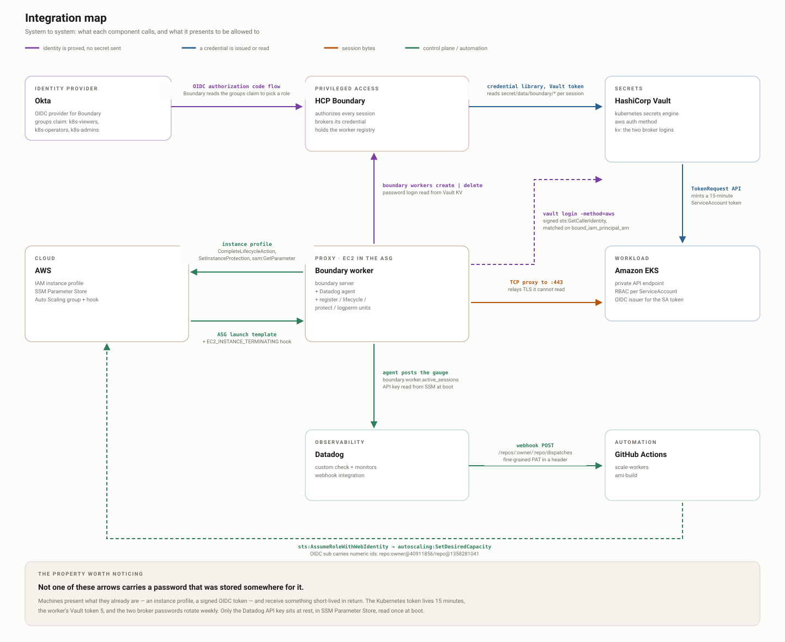

# Integrations — who trusts whom, and with what

Ten system-to-system integrations hold this project together. This page maps
each one: what is being proved, which credential carries it, where it is
configured, and how it fails.

No humans in this map — a person authenticates to Okta, and everything after
that is machines proving themselves to one another.



**The property worth noticing:** no component stores a password for the next
one. Machines prove *what they are* — an instance role, an OIDC token — and
receive a short-lived credential in return. Only two human secrets exist: the
Okta account, and the Datadog API key in Parameter Store.

---

## 1 · Okta → Boundary

| | |
|---|---|
| Proves | which person this is, and which groups they belong to |
| Credential | OIDC ID token |
| Configured in | Okta app + `boundary/` OIDC auth method and managed groups |
| Lifetime | the Okta session |

Boundary reads the `groups` claim and matches it against managed groups, which
carry the roles, which grant the targets. Tier is decided here and nowhere else.

**Fails when** the groups claim is missing from the ID token. Everything looks
correct — the user authenticates fine — but every managed group is empty and no
target is visible. Okta only emits the claim if you add it under *Sign On →
OpenID Connect ID Token → Groups claim*.

---

## 2 · Boundary → Vault

| | |
|---|---|
| Proves | Boundary is allowed to read this credential path |
| Credential | a periodic Vault token held by the credential store |
| Configured in | `boundary/credentials.tf` |
| Lifetime | renews indefinitely — Boundary is a trusted party here |

One credential library per tier. When a session is authorized, Boundary calls
Vault, gets a fresh Kubernetes token, and hands it to you with the session.

**Fails when** the credential store's Vault address goes stale. The internal NLB
hostname changes every time the Service is recreated, and the error surfaces as
a session problem rather than a Vault one.

---

## 3 · Vault → Kubernetes

| | |
|---|---|
| Proves | Vault may mint tokens for these ServiceAccounts |
| Credential | a Kubernetes ServiceAccount token held by Vault |
| Configured in | `k8s/rbac.yaml` + `vault/` secrets engine roles |
| Lifetime | issued tokens live **15 minutes** |

Vault calls the TokenRequest API to mint a token for `vault-viewer`,
`vault-operator` or `vault-admin` — whichever the credential library names.

**Fails in two ways worth knowing.** Vault's own credential must not expire:
`kubectl create token` is silently capped at 24h by EKS, so use a
`kubernetes.io/service-account-token` Secret instead. And Vault needs `create`
on `serviceaccounts/token` — the Helm chart's `system:auth-delegator` only
grants token *validation*, so configuration succeeds and issuance fails.

---

## 4 · Worker → Vault

| | |
|---|---|
| Proves | this EC2 instance is a Boundary worker |
| Credential | **none** — it signs an STS `GetCallerIdentity` request |
| Configured in | `brokers/` Vault AWS auth roles, bound to the instance role ARN |
| Lifetime | the Vault token lives 5 minutes |

The cleanest integration in the project. Nothing is copied onto the instance;
it proves what it is with the credentials AWS already gave it, and Vault checks
the ARN.

**Fails when** `VAULT_ADDR` is not *exported*. `source /etc/boundary/env` sets a
shell variable, but the `vault` CLI is a child process reading the environment —
so it falls back to `https://127.0.0.1:8200` and fails against an address nobody
configured. Hence `export` on every line of that file.

---

## 5 · Worker → Boundary

| | |
|---|---|
| Proves | this worker may create (or delete) a worker record |
| Credential | one of two broker passwords, read from Vault KV at boot |
| Configured in | `brokers/` accounts, users and roles |
| Lifetime | rotated weekly |

Two accounts, one verb each: `worker-registrar` may only create, and
`worker-deregistrar` may only delete. Split so a leaked registration credential
cannot remove your fleet.

**Fails when** the account exists but was never attached to its user. Grants
reach a login through role → user → account → auth method, and a break anywhere
gives a successful login with zero permissions — `403` at boot while the role
reads as perfectly configured. `403` not `401` is the tell.

---

## 6 · Worker → EKS

| | |
|---|---|
| Proves | nothing — the worker is a TCP proxy, not a client |
| Credential | none; it relays ciphertext it cannot read |

TLS is end to end between your `kubectl` and the EKS API. The worker forwards
bytes. That is why `--tls-server-name` is required: you dial `127.0.0.1` but
validate the real EKS certificate.

---

## 7 · Worker → AWS

| | |
|---|---|
| Proves | this instance is itself |
| Credential | the EC2 instance profile |
| Configured in | `asg/main.tf` inline policy |

Exactly four permissions: complete a lifecycle action, send its heartbeat, set
its own scale-in protection, and read one SSM parameter. Plus
`AmazonSSMManagedInstanceCore` so you can actually get a shell on it.

**Fails when** the managed policy is missing — the instance never appears in
Session Manager, and every later problem has to be diagnosed from the outside.

---

## 8 · Worker → Datadog

| | |
|---|---|
| Proves | this agent belongs to your Datadog org |
| Credential | API key, read from SSM Parameter Store at boot |
| Configured in | `user-data.sh.tpl` + the SecureString parameter |

The key is never baked into the AMI. The image ships with a **dummy** key, and
user-data replaces it at boot.

**Fails quietly.** If user-data does not overwrite `datadog.yaml`, the agent
runs happily on the dummy key and every submission is rejected. `datadog-agent
status` looks healthy end to end. Check
`grep -c '^api_key: 0123456789abcdef' /etc/datadog-agent/datadog.yaml`.

---

## 9 · Datadog → GitHub

| | |
|---|---|
| Proves | this webhook may dispatch to your repo |
| Credential | fine-grained PAT, this repo only, *Contents: read and write* |
| Configured in | `datadog/main.tf` webhook custom headers |

Datadog holds the metric but cannot change an ASG, so it posts a
`repository_dispatch` and lets a workflow do it.

**Fails silently.** A bad token or wrong repo path gives you a red monitor and
an empty Actions tab — which looks exactly like the monitor not firing. Check
Actions whenever a monitor is red.

---

## 10 · GitHub → AWS

| | |
|---|---|
| Proves | this workflow is running in your repository |
| Credential | **none** — a signed OIDC token, no static keys |
| Configured in | `asg/github-oidc.tf` |

**The trap that cost hours.** GitHub's `sub` claim is not `repo:owner/name`. It
carries immutable numeric ids:

```
expected  repo:rosaliei/boundary-eks-vault-okta:*
actual    repo:rosaliei@40911856/boundary-eks-vault-okta@1358281041:ref:refs/heads/main
```

A policy written the documented way never matches and fails with `Not authorized
to perform sts:AssumeRoleWithWebIdentity` while looking entirely correct. Print
the real claim from a throwaway workflow rather than guessing — see item 15 in
[notes/Issues.md](notes/Issues.md).

---

## Reading the failures together

Three failure shapes recur, and recognising them saves hours:

| Shape | Where it bit | What you see |
|---|---|---|
| An address is set but not **exported** | **4** (and the `boundary` CLI likewise) | the CLI silently uses its own localhost default and reports `connection refused` against a port nothing is listening on |
| A valid credential with **no authority** | **5**, **10** | `403`, never `401` — the login succeeds and every action is refused, while the role reads as perfectly configured |
| A component reports healthy, **delivers nothing** | **8**, **9** | agent status green on a dummy key; monitor red with an empty Actions tab |

A successful authentication proves identity, never permission. And a component
saying "OK" only means it did its own job, not that the next one received
anything.
