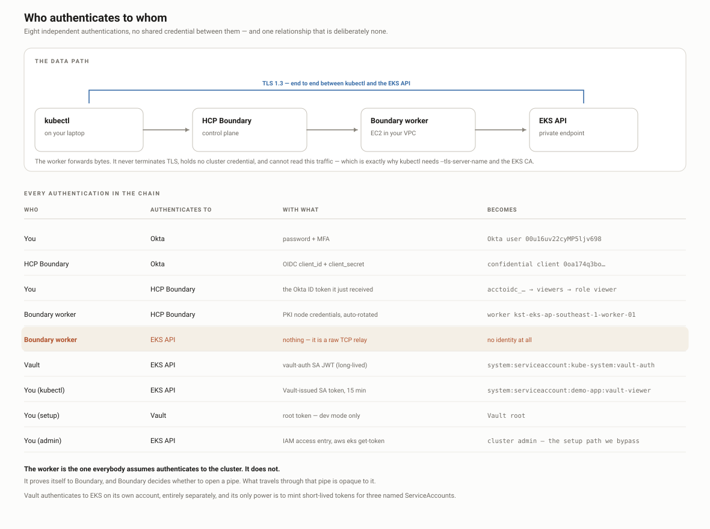

# EKS Access via Okta → Boundary → Vault

Short-lived, RBAC-scoped Kubernetes access to a **private** EKS endpoint. No
kubeconfig handed out, no long-lived credentials, no public API surface.

This README is the **manual runbook** — every step done by hand, in the order
that works. Terraform for each layer lives in `aws/`, `vault/` and
`boundary/` and can replace these steps once the flow is understood.

New here? Go to [**Start here — the five scenes**](#start-here--the-five-scenes)
first. Each one has a *Manual* half and an *Automation* half; do them in order.

---

## The two tokens (read this first)

Almost every confusion in this stack comes from conflating them:

| | Okta ID token | Kubernetes ServiceAccount token |
|---|---|---|
| Issued by | Okta | The EKS API server |
| `iss` | `https://trial-9050012.okta.com` | `https://oidc.eks.<region>.amazonaws.com/id/<id>` |
| `sub` | your Okta user id | `system:serviceaccount:demo-app:vault-viewer` |
| Proves identity to | **Boundary** | **Kubernetes** |
| Lifetime | Okta session | 15 minutes |

Boundary decides *whether you may reach the cluster's API port*.
Kubernetes RBAC decides *what you may do once you are there*.
They are independent — a Boundary admin holding a viewer SA token still cannot
write to the cluster.

## Flow, end to end


<details>
<summary>Text version</summary>

```
 you ──▶ Okta                    authenticate the human
         │  ID token (groups claim)
         ▼
      Boundary                   managed group → role → authorize-session
         │  session
         ▼
   self-managed worker           the only thing with line of sight to the
   (EC2, private subnet)         private EKS endpoint
         │
         ▼                       127.0.0.1:8443 on your laptop
   EKS API :443  ◀── kubectl --token=<SA token>
                          ▲
                          │  15-min ServiceAccount token
                       Vault kubernetes secrets engine
                          │
                       k8s RBAC (Role + RoleBinding) bounds it
```

</details>

### Who authenticates to whom



The worker is the one people assume authenticates to the cluster. It does not —
it proves itself to *Boundary* with PKI node credentials, and Boundary decides
whether to open a pipe. TLS runs end to end between kubectl and the EKS API, so
the worker cannot read what passes through it. That is why kubectl needs
`--tls-server-name` and the EKS CA rather than trusting the proxy.

Vault authenticates to EKS separately, as
`system:serviceaccount:kube-system:vault-auth`, and its only power is minting
short-lived tokens for three named ServiceAccounts.

Build order matters: **EKS → k8s RBAC → Vault → worker → Okta → Boundary**.
Each layer references names created by the one before it.

---

### Traffic flow


The property that makes this work: **nothing accepts an inbound connection from
the internet.** The worker has no public IP and no inbound rule. It dials *out*
to HCP on 9202 through the NAT gateway and holds that tunnel open; HCP pushes
session bytes back down it. That is why a private EKS endpoint is reachable
without a VPN, a bastion, or exposing the API server.

TLS is end to end between kubectl and the EKS API — every hop in between relays
ciphertext it cannot read. Hence `--tls-server-name` and the cluster CA on the
kubectl command: you dial `127.0.0.1`, but you validate the EKS certificate.

## Start here — the five scenes

**Steps 1–5 are the foundation. They are very important and they build on each
other — do not skip one, do not reorder.** Each scene is a drawing in the
*platform-engineering* Excalidraw collection. For every step: **Manual** is what
you do by hand (console, UI, CLI) to understand it; **Automation** is the code
in this repo that does the same thing once you do.

| # | Scene (open the drawing) | What it settles | Manual | Automation |
|---|---|---|---|---|
| **1** | [VPC & subnets — analysis → ClickOps](https://app.excalidraw.com/s/9hD7S5FgGWN/73UzMQca6Am) | one VPC, 3 AZs, public + private subnets, NAT, the subnet tags EKS and the NLB discover | AWS console, exactly as drawn: VPC → subnets → NAT → route tables → tags `kubernetes.io/role/elb` / `internal-elb` | [`aws/vpc.tf`](aws/vpc.tf) — `terraform-aws-modules/vpc` |
| **2** | [EKS — detailed analysis](https://app.excalidraw.com/s/9hD7S5FgGWN/2XoNL6sXrLz) | private endpoint, access-entries auth, node group, the RBAC tiers (SA → RoleBinding → Role) | console: create cluster (private only), node group, access entry for your IAM user; then `kubectl apply -f k8s/rbac.yaml` — [Step 1](#step-1--eks-cluster), [Step 2](#step-2--kubernetes-rbac) | [`aws/eks.tf`](aws/eks.tf), [`k8s/rbac.yaml`](k8s/rbac.yaml) |
| **3** | [Boundary ↔ Okta identity](https://app.excalidraw.com/s/9hD7S5FgGWN/7rGrKHxR5PL) | Okta app + groups claim → OIDC auth method → managed groups → roles → grants | Okta admin + Boundary UI — [Step 5](#step-5--okta), [Step 6](#step-6--boundary), [`boundary/MANUAL-SETUP.md`](boundary/MANUAL-SETUP.md) | [`boundary/main.tf`](boundary/main.tf) (managed groups, roles, host catalog, targets) |
| **4** | [Boundary → Okta → Vault → EKS RBAC](https://app.excalidraw.com/s/9hD7S5FgGWN/2didKmVk95t) | the whole runtime path: worker in the VPC, Vault k8s secrets engine, credential brokering, one target per tier, the numbered 1–8 flow | [Step 3](#step-3--vault), [Step 4](#step-4--boundary-worker), [Step 7](#step-7--vault-credential-brokering), [Step 8](#step-8--end-to-end), [`vault/MANUAL-SETUP.md`](vault/MANUAL-SETUP.md) | [`aws/boundary-worker.tf`](aws/boundary-worker.tf), [`vault/main.tf`](vault/main.tf), [`boundary/credentials.tf`](boundary/credentials.tf) |
| **5** | [Issues — what broke and why](https://app.excalidraw.com/s/9hD7S5FgGWN/9x6Q0ZNzt0P) | the 12 failures from the real build, their causes, the checklist, and why the autoscaling design looks the way it does | run the checklist in [State before autoscaling](#state-before-autoscaling-2026-09-15); then [`autoscaling/MANUAL-WALKTHROUGH.md`](autoscaling/MANUAL-WALKTHROUGH.md) parts A–G by hand | [`autoscaling/README.md`](autoscaling/README.md) — Terraform + Packer/Ansible + GitHub Actions |

Rule of thumb for each step: **do the Manual column once, watch it work, then
apply the Automation column and confirm it produces the same objects.** If the
two differ, the drawing is the truth and the code has drifted.

### Supporting boards

Older working boards in the *hellocloud* collection — useful detail, not part
of the path above.

| Board | What it shows |
|---|---|
| [Architecture — detailed](https://app.excalidraw.com/s/9hD7S5FgGWN/6qkBs97pPLA) | high level, the Vault credential pipeline, traffic flow, the two tokens, build order |
| [Manual runbook](https://app.excalidraw.com/s/9hD7S5FgGWN/6nhIbrWDS4R) | all 9 build steps as command cards, plus captured output from a real run |
| [Step 7 — Boundary build evidence](https://app.excalidraw.com/s/9hD7S5FgGWN/5A6xg4Owie) | CLI output from building the Boundary side, and where steps 8/9 stand |
| [Scratch / working notes](https://app.excalidraw.com/s/9hD7S5FgGWN/4WYkgQqBXUp) | original console walkthrough and annotations |

### Editable sources in the repo

Committed `.excalidraw` files — open at [excalidraw.com](https://excalidraw.com)
via *File → Open*:

| File | What it shows |
|---|---|
| [docs/architecture.excalidraw](docs/architecture.excalidraw) | the whole system, with the numbered runtime flow |
| [docs/setup-steps.excalidraw](docs/setup-steps.excalidraw) | all 8 build steps, each with the trap that bites in it |
| [docs/command-walkthrough.excalidraw](docs/command-walkthrough.excalidraw) | steps 3–8 as command cards |

Terminal captures from the real build live in `docs/run-logs/` on the build
machine only (gitignored).

## Reference values

Replace with your own. **Everything except the region, cluster name, Boundary
cluster and Okta auth method is regenerated on every rebuild** — the API
endpoint, all `ttcp_` target ids, the project id, the worker id and the Vault
NLB hostname all change. Re-read them from `terraform output` and
`boundary targets list` rather than trusting this block.

Values below are from the live state on 2026-09-15 (after the target split —
see "State before autoscaling" near the end).

```
Region / profile   ap-southeast-1 / pegb        (the `default` profile is expired - always pass pegb)
Cluster            hc-eks-cluster  (k8s 1.35, auth mode API)
API endpoint       6F66E12DC9593ADDD5CA21204650E2DA.gr7.ap-southeast-1.eks.amazonaws.com
                   private 10.0.2.250 / 10.0.1.7
VPC                10.0.0.0/16   private 10.0.1-3.0/24   public 10.0.101-103.0/24
Boundary           https://95390bdc-e040-47df-8638-7c996c0f98f7.boundary.hashicorp.cloud
Org / project      o_cr9ncHM3kS (kst-devops) / p_UMfkhp0pCv (linux)   <- built by hand; boundary/ Terraform still says eks-access
Global pw auth     ampw_WNbi76VghW
Worker             kst-eks-ap-southeast-1-worker-01
                   w_K3RyLndlV4   tags type=[eks, vpc, private, k8s_vault]   Boundary v1.0.1+ent
Okta auth method   amoidc_eY8ldrT0GG (HC OKTA)  client 0oa174q3bo5aaqXHr698
Vault (internal)   http://aa837cd050a9d43028df5e6987267f93-d3fb677640c1fdfb.elb.ap-southeast-1.amazonaws.com:8200
                   (changes every time the Service is recreated - read it with
                    kubectl -n vault get svc vault -o jsonpath='{.status.loadBalancer.ingress[0].hostname}')
Credential store   csvlt_xEcOfrT5Sx   worker_filter "eks" in "/tags/type"

Targets, one per tier - each brokers exactly ONE Vault credential:
  eks-api-viewer     ttcp_d9cw5TgQOO    ->  clvlt_fC94KKXa3Z  ->  kubernetes/creds/viewer
  eks-api-operator   ttcp_jeFYI2LB06    ->  clvlt_xK10mY4Mol  ->  kubernetes/creds/operator
  eks-api-admin      ttcp_oZ4UOSIoXm    ->  clvlt_YwAqiKc1TJ  ->  kubernetes/creds/admin
  egress_worker_filter on all three:  "k8s_vault" in "/tags/type"

Managed groups on the Okta auth method:
  viewers   mgoidc_bS1PpJhm0i      operators mgoidc_ZKiUHEKsPZ
  admins    mgoidc_EzvkGq9PYp

Roles (org level, grant scope this + the project):
  viewers  r_7dhKthDv6h  ids=ttcp_d9cw5TgQOO;type=target;actions=list,no-op,authorize-session
  operator r_ONl6HaVG9B  ids=ttcp_jeFYI2LB06;type=target;actions=list,no-op,read,authorize-session
  admin    r_s4rOl3yCNN  ids=*;type=target;actions=*
```

---

# Step 1 — EKS cluster

> **Scene [1](https://app.excalidraw.com/s/9hD7S5FgGWN/73UzMQca6Am) + [2](https://app.excalidraw.com/s/9hD7S5FgGWN/2XoNL6sXrLz)** · **Manual:** AWS console — VPC, subnets, NAT, then EKS with the public endpoint OFF, one node group, an access entry for your IAM user
> **Automation:** [`aws/vpc.tf`](aws/vpc.tf), [`aws/eks.tf`](aws/eks.tf) — `terraform apply` in `aws/`

Infrastructure is the one layer where Terraform is genuinely simpler than
clicking; the manual equivalent is dozens of console screens.

```bash
cd aws
terraform init
terraform apply          # VPC, 3 AZs, NAT, EKS, node group, Boundary worker EC2
```

What matters in the result:

- **Private endpoint enabled**, public endpoint restricted to your `/32`
  (`admin_public_cidrs`). This is why a worker inside the VPC is needed at all.
- `authentication_mode = "API"` — access entries, not the legacy `aws-auth`
  ConfigMap.
- Node group on **AL2023** (`ami_type`); Amazon Linux 2 AMIs do not exist for
  EKS 1.33+.
- Cluster version must be in **standard support**. AWS refuses to create a
  cluster on an end-of-life version — 1.29 and 1.30 are already rejected.

Admin kubeconfig, authenticated by your IAM access entry:

```bash
aws eks update-kubeconfig --region ap-southeast-1 --name hc-eks-cluster --profile pegb
kubectl get nodes
```

This admin path is separate from the Boundary path and stays available for
setup. The demo is about *not* needing it.

---

# Step 2 — Kubernetes RBAC

> **Scene [2](https://app.excalidraw.com/s/9hD7S5FgGWN/2XoNL6sXrLz)** · **Manual:** read `k8s/rbac.yaml` and check each SA → RoleBinding → Role pair against the drawing
> **Automation:** `kubectl apply -f` [`k8s/rbac.yaml`](k8s/rbac.yaml)

Vault issues tokens *for* ServiceAccounts; it does not create them. These must
exist before Vault is configured.

```bash
kubectl apply -f k8s/rbac.yaml
kubectl -n demo-app get sa,role,rolebinding
```

Creates namespace `demo-app` and three tiers, each ServiceAccount bound to a
namespaced Role:

```
vault-viewer   ──▶ viewer-binding   ──▶ Role viewer     (get/list/watch)
vault-operator ──▶ operator-binding ──▶ Role operator   (+ manage workloads)
vault-admin    ──▶ admin-binding    ──▶ Role admin      (full, namespace only)
```

Verify the boundaries are real:

```bash
kubectl auth can-i get pods           --as=system:serviceaccount:demo-app:vault-viewer -n demo-app   # yes
kubectl auth can-i delete deployments --as=system:serviceaccount:demo-app:vault-viewer -n demo-app   # no
```

> **Note:** the `viewer` Role currently includes `secrets` in its read list. A
> read-only tier that can read every Secret in the namespace is worth removing
> before this is anything but a demo.

---

# Step 3 — Vault

> **Scene [4](https://app.excalidraw.com/s/9hD7S5FgGWN/2didKmVk95t)** · **Manual:** 3a–3e below with the CLI, or [`vault/MANUAL-SETUP.md`](vault/MANUAL-SETUP.md)
> **Automation:** [`vault/main.tf`](vault/main.tf) — secrets engine + one role per tier (3a install stays manual)

## 3a. Install (dev mode)

Dev mode is in-memory and auto-unsealed. **Every restart wipes the config in
3c–3d.** Demos only.

```bash
helm repo add hashicorp https://helm.releases.hashicorp.com
helm repo update

helm install vault hashicorp/vault \
  --namespace vault --create-namespace \
  --set "server.dev.enabled=true" \
  --set "server.dev.devRootToken=root" \
  --set "injector.enabled=false"

kubectl -n vault rollout status statefulset/vault --timeout=180s
```

## 3b. Let Vault mint ServiceAccount tokens

**The step everything else fails on.** The Helm chart binds Vault to
`system:auth-delegator`, which grants `tokenreviews` and
`subjectaccessreviews` — the ability to *validate* tokens. The Kubernetes
secrets engine does the opposite: it *creates* tokens via the TokenRequest API,
which needs `create` on `serviceaccounts/token`. Without this, configuration
succeeds and credential requests return 403.

This is applied by `k8s/rbac.yaml` in step 2 — the ServiceAccount, the Role, the
RoleBinding and the Secret-backed token all live there. Nothing to paste:

```bash
kubectl -n demo-app get sa vault-secrets
kubectl -n demo-app describe role vault-token-creator
```

The grant that matters:

```yaml
rules:
  - apiGroups: [""]
    resources: ["serviceaccounts/token"]
    verbs: ["create"]
    resourceNames: ["vault-viewer", "vault-operator", "vault-admin"]
```

> **`resourceNames` is load-bearing, not decoration.** Without it,
> `create` on `serviceaccounts/token` lets Vault mint a token for *any*
> ServiceAccount in the cluster — including one bound to `cluster-admin`. That
> is a documented privilege-escalation path. Verified live: with the three names
> present, minting `vault-viewer` succeeds and minting `default` is refused with
> `serviceaccounts "default" is forbidden`.
>
> `create` normally cannot be name-scoped, because the object does not exist yet.
> Subresources are the exception: TokenRequest posts to
> `/serviceaccounts/{name}/token`, so the name is known at authorization time.

A **namespaced Role**, not a ClusterRole. A ClusterRole with `resourceNames`
restricts by name but not namespace — a `vault-viewer` in any other namespace
would still match.

Two ServiceAccounts, deliberately:

| ServiceAccount | Grant | Purpose |
|---|---|---|
| `demo-app/vault-secrets` | the Role above | **mint** tokens (secrets engine) |
| `kube-system/vault-auth` | `system:auth-delegator` | **validate** tokens (auth method, only if you enable it) |

Never one identity for both. Minting is the dangerous power.

> `kubectl auth can-i create serviceaccounts/token --as=...` reports **`no`
> even when this is granted** — it mis-evaluates subresources under
> impersonation. Test the real operation (step 3e) instead.

## 3c. Reach Vault

Vault is a ClusterIP service in a private cluster; nothing routes to it from
outside, including the Boundary worker.

```bash
kubectl -n vault port-forward svc/vault 8200:8200      # leave running
export VAULT_ADDR=http://127.0.0.1:8200
export VAULT_TOKEN=root
vault status                                            # Sealed: false, Storage: inmem
```

## 3d. Enable and configure the secrets engine

```bash
vault secrets enable -path=kubernetes kubernetes

TOKEN_REVIEW_JWT=$(kubectl create token vault-auth -n kube-system --duration=8760h)
KUBE_CA=$(aws eks describe-cluster --name hc-eks-cluster --region ap-southeast-1 --profile pegb \
  --query 'cluster.certificateAuthority.data' --output text | base64 -d)

vault write kubernetes/config \
  kubernetes_host="https://6F66E12DC9593ADDD5CA21204650E2DA.gr7.ap-southeast-1.eks.amazonaws.com" \
  kubernetes_ca_cert="$KUBE_CA" \
  service_account_jwt="$TOKEN_REVIEW_JWT" \
  disable_local_ca_jwt=true
```

One Vault role per ServiceAccount. The link between Vault and Kubernetes is the
**ServiceAccount name, matched as a string** — nothing validates it:

```bash
for R in viewer operator admin; do
  vault write kubernetes/roles/$R \
    allowed_kubernetes_namespaces="demo-app" \
    service_account_name="vault-$R" \
    token_default_ttl="15m" \
    token_max_ttl="1h"
done
```

> Running Vault **in-cluster** instead lets you skip the JWT and CA entirely —
> `vault write -f kubernetes/config` reads them from the pod's own mount, and
> the ClusterRole in 3b binds to `vault/vault` rather than
> `kube-system/vault-auth`. The config above is the external-Vault shape.

## 3e. Prove it issues credentials

```bash
vault write kubernetes/creds/viewer kubernetes_namespace=demo-app
```

`vault write`, not `read` — the engine requires the namespace parameter. A
403 here means step 3b was skipped.

---

# Step 4 — Boundary worker

> **Scene [4](https://app.excalidraw.com/s/9hD7S5FgGWN/2didKmVk95t)** · **Manual:** read the auth token off the instance over SSM and activate it from your laptop (below)
> **Automation:** [`aws/boundary-worker.tf`](aws/boundary-worker.tf) builds the instance; [`autoscaling/`](autoscaling/) replaces it with a self-registering pool

HCP's cloud workers cannot see a private endpoint. A self-managed worker inside
the VPC dials *out* to HCP, giving Boundary a reverse tunnel in.

The EC2 instance is created by `aws/boundary-worker.tf` in step 1 — a
t3.micro in a private subnet, no public IP, no SSH key, SSM only. Cloud-init
installs `boundary-enterprise` and starts a systemd unit.

Registration is **worker-led** — no Boundary credentials touch AWS state:

```bash
# 1. read the auth request token off the instance
aws ssm start-session --target $(terraform -chdir=terraform output -raw boundary_worker_instance_id) \
  --region ap-southeast-1 --profile pegb
sudo /usr/local/bin/worker-auth-token

# 2. activate it (from your laptop)
export BOUNDARY_ADDR=https://95390bdc-e040-47df-8638-7c996c0f98f7.boundary.hashicorp.cloud
boundary authenticate
boundary workers create worker-led \
  -name=kst-eks-ap-southeast-1-worker-01 \
  -worker-generated-auth-token=<TOKEN>

# 3. confirm
boundary workers list -scope-id global
```

Two things that will cost you an hour each:

- **The name cannot be set in `worker.hcl`.** With activation-token auth,
  Boundary refuses to start if the config carries `name` or `description` —
  they must come from the API at registration. Whatever you pass to `-name` is
  what the target filter must match.
- Before registration the worker logs `node is not yet authorized` on a loop.
  That is the normal waiting state, not an error.

---

# Step 5 — Okta

> **Scene [3](https://app.excalidraw.com/s/9hD7S5FgGWN/7rGrKHxR5PL)** · **Manual:** Okta admin console — app, groups, groups claim (5a–5c). This step is manual only
> **Automation:** none — Boundary never returns the Okta client secret, so Terraform cannot own the auth method

## 5a. Application

An **OIDC → Web Application**:

| Field | Value |
|---|---|
| Sign-in redirect URI | `https://<cluster>.boundary.hashicorp.cloud/v1/auth-methods/oidc:authenticate:callback` |
| Sign-out redirect URI | `https://<cluster>.boundary.hashicorp.cloud` |
| Grant type | Authorization Code |

Note the **Client ID** — with several OIDC apps in a tenant it is very easy to
configure the wrong one, and every symptom looks identical.

## 5b. Groups

*Directory → Groups*: create `eks-viewers`, `eks-operators`, `eks-admins` and
assign users. Check the **literal** names — the claim filter is case-sensitive,
so `EKS-Viewers` will not match `eks-.*`.

## 5c. The groups claim

Assigning a user to a group does **not** put groups in the token. That is
configured separately, and *where* depends on which authorization server you
use:

**Org authorization server** (`https://your-org.okta.com`) — the simpler path:

> *Applications → (your app) → Sign On → OpenID Connect ID Token → Edit*
>
> | Field | Value |
> |---|---|
> | Groups claim type | **Filter** — not Expression |
> | Groups claim filter | `groups` · **Matches regex** · `eks-.*` |

`groups` is a **reserved scope** on the org server, which is why Okta refuses
to let you name a *custom* claim `groups` elsewhere — and why the client must
request the `groups` scope (step 6b) for it to appear.

**Custom authorization server** (`.../oauth2/default`) — more moving parts:
define the claim under *Claims*, add a custom scope under *Scopes* (there is no
built-in `groups` scope, so requesting one returns `invalid_scope`), and add an
*Access Policy* + rule permitting your client, or every login fails with
`Policy evaluation failed`.

Verify with **Token Preview** on the authorization server before moving on: the
ID token payload should show `"groups": ["eks-viewers"]`. If it shows group
IDs, the Boundary filters must match the IDs instead.

---

# Step 6 — Boundary

> **Scene [3](https://app.excalidraw.com/s/9hD7S5FgGWN/7rGrKHxR5PL)** · **Manual:** Boundary UI, 6a–6e below, or [`boundary/MANUAL-SETUP.md`](boundary/MANUAL-SETUP.md)
> **Automation:** [`boundary/main.tf`](boundary/main.tf) — managed groups, roles, host catalog, targets (auth method stays manual)

## 6a. Project scope

*Orgs → (your org) → Projects → New* — name `eks-access`.

**Delete the auto-created "Default Grants" role.** It grants
`type=target;actions=list` to `u_auth` — every authenticated user — which makes
targets appear for people who have no role at all. That produces a convincing
illusion of working RBAC: users see the target and then fail at Connect,
because listing and `authorize-session` are different grants.

## 6b. OIDC auth method

Created in the **org** scope, not the project:

| Field | Value |
|---|---|
| Name | `okta-oidc` |
| Issuer | `https://trial-9050012.okta.com` (must match Okta's app Issuer setting) |
| Client ID / Secret | from step 5a |
| Signing algorithms | `RS256` |
| API URL prefix | your Boundary cluster URL |
| Allowed audiences | the Client ID |
| Claims scopes | `profile`, `email`, **`groups`** |

Then set **State → Active (public)** and make it primary for the scope.

`groups` in claims scopes is required on the **org** server and fatal on a
**custom** server that has no such scope. Issuer and scopes must be changed
together.

## 6c. Managed groups

On the auth method, three groups. Membership is recomputed from the token at
**every login** — never synced, so any change needs a fresh login to take
effect:

| Name | Filter |
|---|---|
| `viewers` | `"eks-viewers" in "/token/groups"` |
| `operators` | `"eks-operators" in "/token/groups"` |
| `admins` | `"eks-admins" in "/token/groups"` |

## 6d. Roles

In the **project** scope, principals are the managed groups above:

```
viewer      ids=*;type=target;actions=list,no-op
            ids=*;type=target;actions=authorize-session
            ids=*;type=session;actions=list,read:self,cancel:self

operator    the above, plus read on targets and list on host-catalog/host-set/host

admin       ids=*;type=<target|session|host-catalog|host-set|host>;actions=*
            ids=*;type=<credential-store|credential-library>;actions=*
```

`no-op` makes a resource appear in a list without granting `read` on its
details. `read:self` / `cancel:self` confine session actions to the user's own
sessions.

## 6e. Host catalog and target

In the project:

1. Host catalog → **Static**, name `eks-hosts`
2. Host `eks-api`, address `6F66E12D...gr7.ap-southeast-1.eks.amazonaws.com`
   — the hostname, not an IP; the worker resolves it inside the VPC to the
   private endpoint addresses
3. Host set `eks-api-hosts` containing that host
4. Target `eks-api` — type **TCP**, default port **443**, max session 28800s,
   host source `eks-api-hosts`, and:

```
Egress worker filter:  "eks" in "/tags/type"
```

That filter is load-bearing. It used to match the worker's **registered name**;
it now matches a **tag** the worker sets in its own `worker.hcl`
(`tags { type = ["eks", ...] }`). Reason: [autoscaling](autoscaling/) adds
workers with generated names (`worker-i-0abc…`), and a name filter would leave
every one of them unused. A filter that matches nothing fails at session time
with:

```
No egress workers can handle this session, as they have all been filtered out
```

---

# Step 7 — Vault credential brokering

> **Scene [4](https://app.excalidraw.com/s/9hD7S5FgGWN/2didKmVk95t)** · **Manual:** 7a–7c below: NLB, scoped token, credential store + libraries in the UI (worker filter first!)
> **Automation:** [`boundary/credentials.tf`](boundary/credentials.tf) — store, libraries, one target per tier

Steps 1-6 leave one wart: to get a Vault credential you port-forward to Vault,
which uses your **admin kubeconfig** — the exact access this design exists to
avoid. Boundary can fetch the credential for you instead.

## 7a. Give Vault a stable address in the VPC

A ClusterIP is not routable from the worker EC2. Expose Vault on an internal NLB:

```bash
helm upgrade vault hashicorp/vault -n vault --reuse-values \
  --set "server.service.type=LoadBalancer" \
  --set-string "server.service.annotations.service\.beta\.kubernetes\.io/aws-load-balancer-type=nlb" \
  --set-string "server.service.annotations.service\.beta\.kubernetes\.io/aws-load-balancer-internal=true"
```

`--set-string` matters. Plain `--set` parses `true` as a boolean and Helm fails
with `cannot unmarshal bool into ... annotations of type string`.

## 7b. A scoped Vault token for Boundary

Not root. Boundary requires the token be **periodic, orphan and renewable**:

```bash
vault policy write boundary-broker - <<'EOF'
path "kubernetes/creds/viewer"   { capabilities = ["create", "update"] }
path "kubernetes/creds/operator" { capabilities = ["create", "update"] }
path "kubernetes/creds/admin"    { capabilities = ["create", "update"] }
path "sys/leases/renew"          { capabilities = ["update"] }
path "sys/leases/revoke"         { capabilities = ["update"] }
path "auth/token/renew-self"     { capabilities = ["update"] }
path "auth/token/lookup-self"    { capabilities = ["read"] }
EOF

vault token create -policy=boundary-broker -period=24h -orphan -renewable=true
```

## 7c. Credential store, libraries, and one target per tier

Applied by [boundary/credentials.tf](boundary/credentials.tf). The store carries
a `worker_filter` — Vault is private, so the HCP controller cannot reach it and
the calls must route through the in-VPC worker.

The Kubernetes secrets engine is *written* to and needs a namespace in the body,
so the library uses POST with an explicit request body rather than a plain GET.

Then one target per tier, each bound to its own library. **This is where the
tiering is enforced**: the credential you receive is decided by which target
your role lets you authorize, not by anything you type.

```
viewer   role -> ids=ttcp_QL8eAjhITq ; authorize-session
operator role -> ids=ttcp_pOHfiqkgLC ; authorize-session
```

A wildcard (`ids=*`) here is a privilege escalation: a viewer could authorize
`eks-api-admin` and be handed an admin credential.

---

# Step 8 — End to end

> **Scene [4](https://app.excalidraw.com/s/9hD7S5FgGWN/2didKmVk95t) → [5](https://app.excalidraw.com/s/9hD7S5FgGWN/9x6Q0ZNzt0P)** · **Manual:** two terminals below; then run the checklist in [State before autoscaling](#state-before-autoscaling-2026-09-15)
> **Automation:** [`autoscaling/scripts/loadtest.sh`](autoscaling/scripts/loadtest.sh) opens N sessions; [`autoscaling/README.md`](autoscaling/README.md) takes it from here

```bash
export BOUNDARY_ADDR=https://95390bdc-e040-47df-8638-7c996c0f98f7.boundary.hashicorp.cloud
boundary authenticate oidc -auth-method-id=amoidc_eY8ldrT0GG

# terminal 1 - session AND credential, in one command
boundary connect -target-id=ttcp_QL8eAjhITq -listen-port=8443 -format=json > /tmp/sess.json
```

`8443` is the port on **your laptop**; `443` is what the worker dials at the far
end. Ports below 1024 need root on macOS. The **web UI cannot do this** — it has
no way to open a local port, so TCP targets need the CLI or Boundary Desktop.

```bash
# terminal 2
TOKEN=$(jq -r '.credentials[0].secret.decoded.service_account_token' /tmp/sess.json)

aws eks describe-cluster --name hc-eks-cluster --region ap-southeast-1 --profile pegb \
  --query 'cluster.certificateAuthority.data' --output text | base64 -d > /tmp/eks-ca.crt

kubectl --server=https://127.0.0.1:8443 \
  --certificate-authority=/tmp/eks-ca.crt \
  --tls-server-name=6F66E12DC9593ADDD5CA21204650E2DA.gr7.ap-southeast-1.eks.amazonaws.com \
  --token="$TOKEN" -n demo-app get pods
```

No `vault` command. No port-forward. No admin kubeconfig.

## What the tiers actually do

Measured with `kubectl auth can-i` through each tier's own session:

| Tier | get pods | get secrets | create deploy | delete deploy | kube-system |
|---|---|---|---|---|---|
| viewer | yes | yes | no | no | no |
| operator | yes | yes | yes | yes | no |
| admin | yes | yes | yes | yes | no |

Note `viewer` can read Secrets — see Security notes.

# Problems found on the 2026-09-10/12 rebuild

Everything in this section was hit, measured and fixed on a live rebuild.

**Vault's own credential expires after ~24 hours, and the error blames the wrong
ServiceAccount.** Step 3d originally ran
`kubectl create token vault-auth --duration=8760h`. The API server silently caps
that — **measured on EKS: requested 8760h, granted exactly 24.0h**. A day later
every credential request fails with
`failed to create a service account token for demo-app/vault-viewer: Unauthorized`,
which points at `demo-app/vault-viewer` while the dead credential is
`kube-system/vault-auth`. You cannot raise the cap: it comes from the API
server's `--service-account-max-token-expiration`, and on EKS the control plane
is managed. There is a standing request for it in
[aws/containers-roadmap#1836](https://github.com/aws/containers-roadmap/issues/1836).
Fixed by using a `kubernetes.io/service-account-token` Secret, whose token has
no `exp` claim at all — see step 3b.

**The unscoped token-creator grant was a privilege-escalation path.** `create` on
`serviceaccounts/token` with no `resourceNames` lets Vault mint a token for any
ServiceAccount in the cluster, including any bound to `cluster-admin`. The 24h
expiry was masking it; attaching a non-expiring token would have made it
permanent. Verified after scoping: minting `vault-viewer` succeeds, minting
`default` returns `serviceaccounts "default" is forbidden`.

**Vault ignores its own auto-rotating credential.** `disable_local_ca_jwt=true`
means "do not read the pod's mounted token". Vault runs *in* this cluster, so it
already has a projected token the kubelet rotates forever — and the external
recipe tells it to ignore that and use a pasted one instead. If Vault is
in-cluster, bind the Role to the Vault pod's ServiceAccount and run
`vault write -f kubernetes/config` with no arguments.

**`service_account_jwt` does not have to be a ServiceAccount JWT.** Tested: an
IAM token from `aws eks get-token` — a presigned STS URL, not a JWT — works
fine. Vault sends whatever string it holds as a bearer token and lets the API
server decide. The field name is misleading.

**`kubectl -n vault rollout status statefulset/vault` fails.** The Vault chart's
StatefulSet uses `OnDelete`, so the command errors with
`rollout status is only available for RollingUpdate strategy type`. Use
`kubectl -n vault wait --for=condition=Ready pod/vault-0 --timeout=180s`.

**The Boundary worker never installed — two stacked causes.** First,
`Error: GPG check FAILED`: the HashiCorp repo's `gpgkey` endpoint serves
`CA026560` while the `boundary-enterprise` RPM is signed with the retired
`a621e701`. Under `set -euxo pipefail` that aborts the whole cloud-init, leaving
no binary, no `worker.hcl`, no unit file. Replaced with a pinned release archive
verified by SHA256. Second, a worker newer than its controller cannot enrol —
`1.0.2+ent` against a `1.0.1` controller fails with
`(nodeenrollment.registration.validateFetchRequest) empty nonce` and
`remote error: tls: internal error`. Both are now variables
(`boundary_version`, `boundary_sha256`) in `aws/variables.tf`.

**An egress worker filter alone is not enough — multi-hop is required.** The
client must reach *some* worker, and a self-managed worker in a private subnet
advertises `0.0.0.0:9202` with no public IP. Sessions sit in `pending` and
kubectl dies with `net/http: TLS handshake timeout`. Adding an ingress filter
selecting the HCP-managed workers fixed it immediately:

```
egress_worker_filter  = "/name" == "kst-eks-ap-southeast-1-worker-01"
ingress_worker_filter = "/name" matches "hcp-managed-worker.*"
```

**Worker filters are top-level target fields, not under `.attributes`.** Reading
`.item.attributes.egress_worker_filter` returns nothing and makes a correctly
configured target look unconfigured. They live at `.item.egress_worker_filter`.
`worker_info` in an `authorize-session` response is likewise not populated by
this version — do not diagnose from its emptiness.

**`-vault-token env://VAR` is not resolved by the Boundary CLI.** Creating a
Vault credential store with it sends the literal string `env://VAR`, and Vault
answers `403 permission denied / invalid token`. Only `-token` supports that
indirection. Pass the value.

**Okta trial orgs cannot issue machine-to-machine tokens.** The
`client_credentials` grant is gated behind Okta's **NHI Authentication Tokens**
SKU. The grant simply never appears in the access-policy rule UI, which looks
like a configuration mistake and is not. One request settles it before you build
anything around it:

```bash
curl -s https://<org>.okta.com/oauth2/<authServerId>/.well-known/openid-configuration \
  | jq -r '.grant_types_supported'
# no "client_credentials" -> the SKU is not enabled; the path is closed
```

**The admin `/32` breaks whenever your ISP rotates you.** `admin_public_cidrs`
pinned to an old address locks `kubectl` out entirely, and every symptom looks
like a cluster fault. Check `curl https://checkip.amazonaws.com` against
`aws eks describe-cluster --query 'cluster.resourcesVpcConfig.publicAccessCidrs'`
before debugging anything else.

# Problems along the way

Every one of these was hit while building this. They are recorded because none
of them announced itself clearly, and several cost hours.

## AWS / EKS

**`unsupported Kubernetes version 1.29`**
AWS refuses to *create* a cluster on a version past end-of-life. 1.29 and 1.30
are already rejected. `aws eks describe-cluster-versions` lists what is
creatable; anything in EXTENDED_SUPPORT also bills at a premium.

**`expected length of name_prefix to be in the range (1 - 38)`**
The EKS module derives the node IAM role from `"<node group name>-eks-node-group-"`,
which overran AWS's 38-char cap. Fixed with an explicit `iam_role_name` and
`iam_role_use_name_prefix = false`.

**AL2 AMIs do not exist for EKS 1.33+.** The module leaves `ami_type` unset and
AWS's default would have failed. Pinned to `AL2023_x86_64_STANDARD`.

## Boundary worker

**Worker crash-looped:** `Worker config cannot contain name or description when
using activation-token-based worker authentication`. With `hcp_boundary_cluster_id`,
the name must come from the API at registration (`-name=`), not from `worker.hcl`.

**`No egress workers can handle this session, as they have all been filtered out`**
The target's `egress_worker_filter` said `eks-vpc-worker`; the worker had
actually registered as `kst-eks-ap-southeast-1-worker-01`. The filter must match
the **registered** name exactly. This blocks every session while looking like a
network problem.

## Vault

**Credentials 403 with `cannot create resource "serviceaccounts/token"`.**
The Helm chart binds Vault to `system:auth-delegator`, which grants
`tokenreviews` and `subjectaccessreviews` — the ability to *validate* tokens.
The Kubernetes secrets engine *mints* them via the TokenRequest API and needs
`create` on `serviceaccounts/token`. Configuration succeeds either way; only
credential issuance fails. See step 3b.

**`kubectl auth can-i create serviceaccounts/token --as=...` reports `no` even
when the permission is granted.** It mis-evaluates subresources under
impersonation. Test the real operation instead.

**Revoking a Vault lease does not invalidate the token.** Verified: revoke the
lease, the token still works until its `exp`. Because EKS signs the token and it
is bound to no object, nothing can call it back. Vault's lease is bookkeeping.
`kubernetes_role_name` / `generated_role_rules` mode makes revocation real, at
the cost of Vault needing create/delete on ServiceAccounts and RoleBindings.

**`helm upgrade` failed with `cannot unmarshal bool into ... annotations of type
string`.** Kubernetes annotations must be strings; `--set` parsed `true` as a
boolean. Use `--set-string`. The upgrade silently never happened — `helm history`
showed only revision 1 while the Service stayed ClusterIP.

## Okta — six failed attempts at one claim

This consumed more time than everything else combined. In order:

1. **Groups claim missing entirely.** `claims_scopes` did not request `groups`,
   so no claim arrived and every managed group matched nobody.
2. **`invalid_scope`.** After switching to the custom authorization server,
   requesting `groups` failed — custom servers have no built-in `groups` scope.
3. **`Policy evaluation failed`.** Custom authorization servers deny by default;
   they need an Access Policy permitting the client. The org server does not.
4. **`'groups' is reserved and cannot be used.`** On the org server `groups` is a
   reserved scope, so a *custom* claim cannot be named `groups` — the reason the
   two server types need opposite configurations.
5. **Thin ID tokens.** Okta's docs note the authorization-code flow may return
   groups only via `/userinfo`. Filters were widened to accept either
   (`"x" in "/token/groups" or "x" in "/userinfo/groups"`).
6. **The actual bug:** the app's Group claim filter was `Starts with` with value
   `eks-.*`. "Starts with" is a *literal* prefix match, so it looked for groups
   whose names begin with the characters `eks-.*`. Nothing matched, and **Okta
   omits the claim entirely rather than sending an empty array** — so every
   probe came back identical to "not configured at all". Changing the operator to
   `Matches regex`, or the value to `eks-`, fixed it immediately.

**Debugging technique that finally worked:** create throwaway managed groups with
filters that *must* match — `"/token/email" == "you@example.com"`, then
`"/token/groups" is not empty` and the same for `/userinfo`. One login then
distinguishes "claims are not arriving" from "claims arrive but values differ".
Without this, every failure looks the same.

## Boundary authorization

**Targets visible to everyone.** Two roles grant `type=target;actions=list` to
`u_auth` (every authenticated user): the project's auto-created `Default Grants`,
and a global `Authenticated User Grants`. Users saw all targets regardless of
role and only failed at connect. Listing and `authorize-session` are separate
grants — the second is the real control.

**Privilege escalation via `ids=*`.** The tier roles granted
`ids=*;type=target;actions=authorize-session`, so a viewer could authorize
`eks-api-admin` and receive an admin credential. Grants must name the specific
target ID.

**Managed group membership is evaluated at login, never synced.** Every Okta
change needs a full logout — a cached Okta session reissues the old claims and
nothing appears to change.

## Operational

**Terraform state holds live secrets.** `boundary/terraform.tfstate` contains the
Vault broker token in cleartext. State is gitignored; treat it as a credential.

**A shared Boundary cluster is not isolated by default.** This org sits alongside
34 others, and global-scope roles from other people's setups can carry
`ids=*;type=target` grants. Project isolation depends on roles outside the project.

---

# State before autoscaling (2026-09-15)

What was found and fixed live, one session before the autoscaling work.
Drawn in Excalidraw as *hellocloud → "Issues before autoscaling"*.

**Fixed live in Boundary (not yet reflected in `boundary/*.tf`):**

- The single target `eks-api` carried **all three** credential libraries, so
  every authorized session returned viewer + operator + admin tokens. Split
  into `eks-api-viewer` / `-operator` / `-admin` (ids in the reference block),
  one library each. The viewer target kept the original id.
- `viewers` and `operator` roles granted `ids=*;type=target;actions=authorize-session`.
  Pinned to their own target id.
- Credential store creation from the UI failed until a **worker filter** was
  set — the HCP controller cannot reach the internal NLB; only the in-VPC
  worker can.
- "Cannot add brokered credential sources" was simply: no credential
  **libraries** existed yet. Libraries need `POST` and
  `{"kubernetes_namespace":"demo-app"}`; a GET returns 404/405.
- Editing an org role's scopes threw `iam_role_org_grant_scope_fkey`: an org
  role cannot have `children` **and** an individual project. Pick one.

**Still open:**

- Roles `target-read-only` (`r_hKbTJaPsnM`) and `Login and Default Grants`
  (`r_mAiKdBC8gx`) still grant `authorize-session` on **every** target to
  Google-auth users — including your own Google login. Strip the
  `type=target` line or delete them.
- `boundary/` Terraform expects project `eks-access`, project-scoped roles and
  a name-based worker filter. Live is project `linux`, org-scoped roles, tag
  filters. Either `terraform import` the live objects or accept the drift.
- Node security-group rules for the Vault NLB NodePorts (30773, 32531 from
  0.0.0.0/0) are added by the in-tree cloud controller and are not in
  Terraform. Narrow with `spec.loadBalancerSourceRanges` if wanted.

**Before any further Boundary / Vault change, check:** current Vault NLB
hostname · every filter is a tag filter · each target has exactly one library ·
every `authorize-session` grant is pinned to a target id · worker version ≤ HCP
controller · `--profile pegb`.

---

# Troubleshooting

Symptoms actually hit while building this, and their causes:

| Symptom | Cause |
|---|---|
| `unsupported Kubernetes version 1.29` | Version out of EKS support. `aws eks describe-cluster-versions` lists creatable ones |
| `name_prefix ... (1 - 38), got ...` | Node group IAM role name too long — set `iam_role_name` + `iam_role_use_name_prefix = false` |
| Worker crash-loops, `config cannot contain name or description` | `name` in `worker.hcl` with activation-token auth — set it via `-name` at registration |
| `No egress workers can handle this session` | Target's egress filter does not match the worker's registered name |
| `failed to create a service account token ... forbidden` | Step 3b missing — `auth-delegator` is not enough |
| Okta `invalid_scope` | Requesting `groups` from a custom authorization server that has no such scope |
| Okta `Policy evaluation failed` | Custom authorization server has no Access Policy permitting the client |
| `'groups' is reserved and cannot be used` | Naming a custom claim `groups` — it is a reserved scope on the org server |
| Login works, targets list empty | Managed group matched nobody. Check the claim reaches the **ID token**, then that group names match exactly |
| Target visible but Connect denied | Seeing it via `Default Grants` (`u_auth`), not a role. Listing ≠ `authorize-session` |
| Membership unchanged after fixing Okta | Groups are evaluated at login. Log out fully — a cached Okta session reissues the old claims |

**Debugging managed groups:** create a temporary managed group with a filter you
know must match, e.g. `"/token/email" == "you@example.com"`, and another with
`"/token/groups" is not empty`. One login then distinguishes "claims are not
arriving at all" from "claims arrive but values differ".

---

# File structure

```
aws/                      AWS: VPC, EKS, node group, Boundary worker EC2
  boundary-worker.tf      worker instance, IAM, security group, cloud-init
k8s/rbac.yaml             namespace, ServiceAccounts, Roles, RoleBindings
vault/                    Kubernetes secrets engine + one role per tier
  MANUAL-SETUP.md         dev-mode install, in-cluster variant
boundary/                 scope, managed groups, roles, host catalog, targets
  credentials.tf          Vault credential store, libraries, per-tier targets
  MANUAL-SETUP.md         the same objects built by hand in the UI
docs/                     diagrams (SVG, rendered inline above)
autoscaling/              worker pool on an ASG: self-register / self-deregister,
                          scaled by Datadog -> GitHub Actions  (README.md = automated,
                          MANUAL-WALKTHROUGH.md = the same by hand, parts A-G)
  brokers/                Boundary broker users + Vault AWS-auth roles + KV
  ansible/ packer/        the worker AMI and its three scripts
  asg/ datadog/           ASG + lifecycle hook + GitHub OIDC role; monitors + dashboard
.github/workflows/        scale.yml, ami-build.yml, infra.yml, rotate-broker-creds.yml
```

Three independent Terraform roots, three separate states, applied in order:
`aws/` → `vault/` (optional; the CLI path is documented) →
`boundary/`. They do not share state; values pass by hand or by variable.

`boundary/` takes an existing OIDC auth method **ID** as a variable rather than
managing the auth method — Boundary never returns the Okta client secret, so
Terraform cannot own that resource without the secret being pasted in.

**Not in git, by design:** `*.tfstate` (holds the Vault broker token and cluster
CA in cleartext), `*.tfvars`, `vault-sa-token.txt`, `ca.crt`, kubeconfigs.

# Security notes

Known-weak by design here, and what to change for anything real:

- **Vault dev mode** — in-memory storage (a pod restart wipes every mount, role
  and policy), auto-unsealed, root token `root`, and plaintext HTTP across the
  VPC via the internal NLB.
- **`viewer` can read every Secret in `demo-app`.** Confirmed live. In a
  namespace with real workloads that is database passwords and TLS keys readable
  by the most restricted tier. Drop `secrets` from the viewer Role.
- **The EKS public endpoint is still open** to an admin `/32`. Once Boundary
  works it should be turned off entirely — `cluster_endpoint_public_access = false`.
- **Boundary holds a periodic Vault token** that renews indefinitely, making
  Boundary a trusted party. That is the trade for removing the port-forward.
  Revoke by accessor if needed.
- **`vault-sa-token.txt`** is a long-lived ServiceAccount JWT written to disk by
  the README's original flow. Gitignored; delete it and prefer in-cluster Vault,
  which reads its own projected token and needs no such file.
- **A global role grants `target list` to every authenticated user** on this
  shared cluster. Cosmetic (connect is separately gated) but it means target
  names are visible org-wide.
