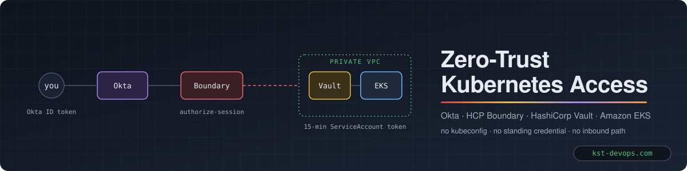
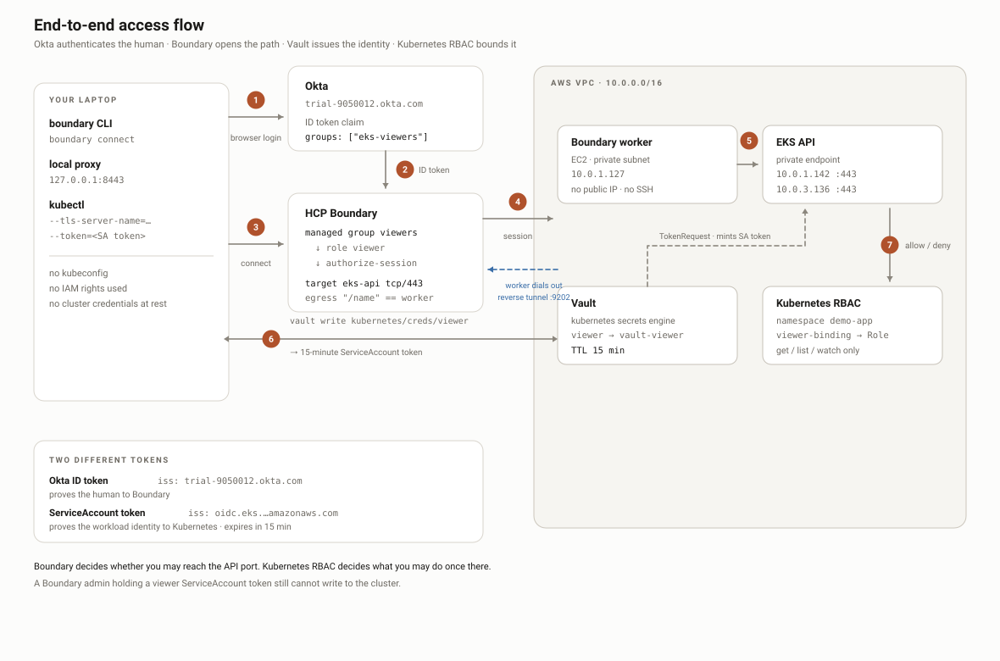
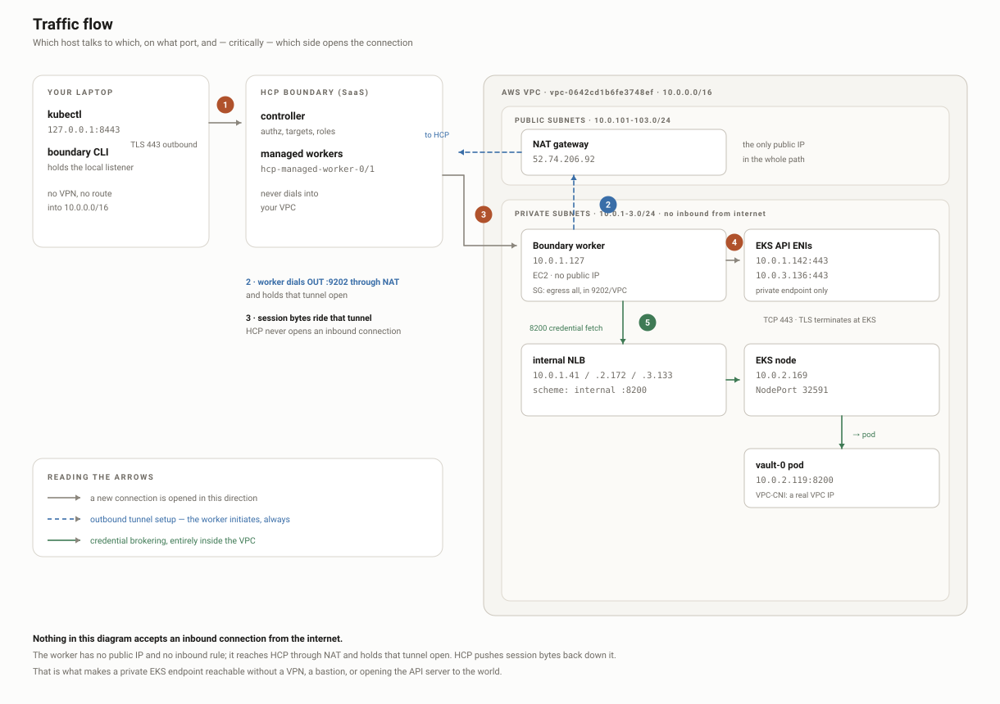

<p align="center">
  <a href="https://kst-devops.com"></a>
</p>

<h1 align="center">Zero-Trust Kubernetes Access</h1>

<p align="center">
  Identity-driven, short-lived, RBAC-scoped access to a <b>private</b> Kubernetes API —<br>
  no kubeconfig distributed, no long-lived credential anywhere, no inbound network path from the internet.
</p>

<p align="center">
  
  
  
  
  
  
  
  
  
</p>

<p align="center">
  <a href="https://github.com/rosaliei/boundary-eks-vault-okta/actions/workflows/infra.yml"></a>
  <a href="https://github.com/rosaliei/boundary-eks-vault-okta/actions/workflows/ami-build.yml"></a>
  <a href="https://github.com/rosaliei/boundary-eks-vault-okta/actions/workflows/scale.yml"></a>
  <a href="https://github.com/rosaliei/boundary-eks-vault-okta/actions/workflows/rotate-broker-creds.yml"></a>
</p>

<p align="center">
  <a href="#start-here--the-five-scenes"></a>
  <a href="https://kst-devops.com"></a>
</p>

---

## 1. The problem

Teams that run Kubernetes on a private endpoint usually solve access with one of
three things: a VPN, a bastion host, or a kubeconfig file handed to every
engineer. Each one ends the same way — a long-lived credential on a laptop, an
inbound door in the network, and no reliable answer to *who did what, and were
they still allowed to at the time?*

The requirements here were stricter:

| Requirement | Meaning in practice |
|---|---|
| **Identity is the perimeter** | access is granted to a person in an Okta group, never to a file or an IP |
| **Credentials expire by default** | every Kubernetes token lives 15 minutes and is minted per session |
| **Least privilege is enforced, not requested** | the tier you get (viewer / operator / admin) is decided by your group — you cannot ask for more |
| **No inbound surface** | the EKS endpoint stays private; nothing in the VPC accepts a connection from outside |
| **Auditable** | every session is authorized by a control plane and recorded, with the identity attached |
| **Elastic** | access capacity grows and shrinks with demand, with zero human steps |

## 2. The solution

Each capability is delivered by a purpose-built technology, chosen for the job
it does rather than the tool it is:

| Capability | Technology | Role in this design |
|---|---|---|
| Identity provider (IdP) | **Okta** | authenticates the human; issues an ID token carrying the `groups` claim that drives every downstream decision |
| Privileged Access Management (PAM) | **HCP Boundary** | the policy enforcement point: maps Okta groups → roles → targets, authorizes each session, brokers the credential, proxies the connection through a worker inside the VPC |
| Secrets management & dynamic credentials | **HashiCorp Vault** (Kubernetes secrets engine) | mints a 15-minute ServiceAccount token per session, bound to a named RBAC tier; Boundary fetches it so the user never touches Vault |
| Workload platform | **Amazon EKS** (private endpoint, access-entries auth) | the protected system; Kubernetes RBAC bounds what each tier may do |
| Network isolation | **AWS VPC**, private subnets, NAT-only egress | the worker dials *out* to Boundary; nothing dials in |
| Infrastructure as code | **Terraform** | one root per layer: `aws/`, `vault/`, `boundary/`, `autoscaling/` |
| Image build & configuration | **Packer + Ansible** | immutable worker AMI; instance-specific facts arrive at boot |
| Observability & scaling signal | **Datadog** | active-session metric, monitors, dashboard; the source of truth for scale decisions |
| Delivery & automation | **GitHub Actions** (OIDC to AWS, no static keys) | AMI builds, infrastructure apply, scale actuation, credential rotation |

## 3. Outcomes

- **Zero standing access.** No kubeconfig on any laptop. The only long-lived
  identity in the chain is the person's Okta account.
- **One command, one session, one credential.** `boundary connect` opens the
  tunnel *and* returns the 15-minute token for the caller's tier.
- **Tiering is structural.** One Boundary target per tier, one Vault credential
  library per target, one Kubernetes RBAC Role per ServiceAccount. A viewer
  cannot be handed an admin token because no path exists for it.
- **Private stays private.** The EKS API is never exposed; the Boundary worker
  holds a reverse tunnel out to the control plane.
- **Elastic access layer.** Workers on an Auto Scaling Group register and
  deregister themselves, driven by Datadog session counts through GitHub Actions
  — see [`autoscaling/`](autoscaling/).

## 4. Architecture



### The two tokens

Almost every confusion in this stack comes from conflating them:

| | Okta ID token | Kubernetes ServiceAccount token |
|---|---|---|
| Issued by | Okta | The EKS API server (via Vault) |
| `iss` | `https://<org>.okta.com` | `https://oidc.eks.<region>.amazonaws.com/id/<id>` |
| `sub` | your Okta user id | `system:serviceaccount:demo-app:vault-viewer` |
| Proves identity to | **Boundary** | **Kubernetes** |
| Lifetime | Okta session | 15 minutes |

Boundary decides *whether you may reach the cluster's API port*.
Kubernetes RBAC decides *what you may do once you are there*.
They are independent — a Boundary admin holding a viewer SA token still cannot
write to the cluster.

### Traffic flow



The property that makes this work: **nothing accepts an inbound connection from
the internet.** The worker has no public IP and no inbound rule. It dials *out*
to HCP on 9202 through the NAT gateway and holds that tunnel open; HCP pushes
session bytes back down it. That is why a private EKS endpoint is reachable
without a VPN, a bastion, or exposing the API server.

TLS is end to end between kubectl and the EKS API — every hop in between relays
ciphertext it cannot read. Hence `--tls-server-name` and the cluster CA on the
kubectl command: you dial `127.0.0.1`, but you validate the EKS certificate.

Build order matters: **EKS → Kubernetes RBAC → Vault → worker → Okta → Boundary**.
Each layer references names created by the one before it.

---

## Start here — the five scenes

AI can generate every file in this repository in minutes. What it cannot do is
understand the system for me — and understanding is the thing an operator is
actually paid for at 3 a.m. So I built this the slow way first: **every layer by
hand in the console and the UI (ClickOps), until I could draw it from memory,
and only then automated it.** Every picture below is my own work, drawn in
Excalidraw as I went. The code is the *output* of that understanding, not a
substitute for it.

**Scenes 1–5 are the foundation. They build on each other — do them in order.**
For every scene: **Manual** is what you do by hand to understand it;
**Automation** is the code in this repo that does the same thing once you do.

| # | Scene (open the drawing) | What it settles | Manual | Automation |
|---|---|---|---|---|
| **1** | [VPC & subnets — analysis → ClickOps](https://app.excalidraw.com/s/9hD7S5FgGWN/73UzMQca6Am) | one VPC, 3 AZs, public + private subnets, NAT, the subnet tags EKS and the NLB discover | AWS console, exactly as drawn: VPC → subnets → NAT → route tables → tags `kubernetes.io/role/elb` / `internal-elb` | [`aws/vpc.tf`](aws/vpc.tf) — `terraform-aws-modules/vpc` |
| **2** | [EKS — detailed analysis](https://app.excalidraw.com/s/9hD7S5FgGWN/2XoNL6sXrLz) | private endpoint, access-entries auth, node group, the RBAC tiers (SA → RoleBinding → Role) | console: create cluster (private only), node group, access entry for your IAM user; then `kubectl apply -f k8s/rbac.yaml` — [Step 1](#step-1--eks-cluster), [Step 2](#step-2--kubernetes-rbac) | [`aws/eks.tf`](aws/eks.tf), [`k8s/rbac.yaml`](k8s/rbac.yaml) |
| **3** | [Boundary ↔ Okta identity](https://app.excalidraw.com/s/9hD7S5FgGWN/7rGrKHxR5PL) | Okta app + groups claim → OIDC auth method → managed groups → roles → grants | Okta admin + Boundary UI — [Step 5](#step-5--okta), [Step 6](#step-6--boundary), [`boundary/MANUAL-SETUP.md`](boundary/MANUAL-SETUP.md) | [`boundary/main.tf`](boundary/main.tf) (managed groups, roles, host catalog, targets) |
| **4** | [Boundary → Okta → Vault → EKS RBAC](https://app.excalidraw.com/s/9hD7S5FgGWN/2didKmVk95t) | the whole runtime path: worker in the VPC, Vault k8s secrets engine, credential brokering, one target per tier, the numbered 1–8 flow | [Step 3](#step-3--vault), [Step 4](#step-4--boundary-worker), [Step 7](#step-7--vault-credential-brokering), [Step 8](#step-8--end-to-end), [`vault/MANUAL-SETUP.md`](vault/MANUAL-SETUP.md) | [`aws/boundary-worker.tf`](aws/boundary-worker.tf), [`vault/main.tf`](vault/main.tf), [`boundary/credentials.tf`](boundary/credentials.tf) |
| **5** | [Issues — what broke and why](https://app.excalidraw.com/s/9hD7S5FgGWN/9x6Q0ZNzt0P) | the 12 failures from the real build, their causes, the checklist, and why the autoscaling design looks the way it does | run the checklist, then [`autoscaling/MANUAL-WALKTHROUGH.md`](autoscaling/MANUAL-WALKTHROUGH.md) parts A–G by hand | [`autoscaling/README.md`](autoscaling/README.md) — Terraform + Packer/Ansible + GitHub Actions |

Rule of thumb for each scene: **do the Manual column once, watch it work, then
apply the Automation column and confirm it produces the same objects.** If the
two differ, the drawing is the truth and the code has drifted.

---

## Reference values

Live environment as of **2026-09-17**. Everything except the region, cluster
name, Boundary cluster and Okta auth method is regenerated on a rebuild —
re-read ids from `terraform output` and `boundary targets list` rather than
trusting this table.

### Platform

| Item | Value |
|---|---|
| AWS region / CLI profile | `ap-southeast-1` / `hc-lab` |
| VPC | `10.0.0.0/16` — private `10.0.1-3.0/24`, public `10.0.101-103.0/24` |
| EKS cluster | `hc-eks-cluster` — Kubernetes 1.35, authentication mode `API`, private endpoint |
| EKS API endpoint | `6F66E12DC9593ADDD5CA21204650E2DA.gr7.ap-southeast-1.eks.amazonaws.com` (10.0.2.250 / 10.0.1.7) |
| Vault (internal NLB) | `http://aa837cd050a9d43028df5e6987267f93-d3fb677640c1fdfb.elb.ap-southeast-1.amazonaws.com:8200` — changes when the Service is recreated; read with `kubectl -n vault get svc vault -o jsonpath='{.status.loadBalancer.ingress[0].hostname}'` |

### HCP Boundary

| Item | Value |
|---|---|
| Cluster | `https://95390bdc-e040-47df-8638-7c996c0f98f7.boundary.hashicorp.cloud` |
| Org / project | `o_cr9ncHM3kS` (kst-devops) / `p_UMfkhp0pCv` (linux) |
| Global password auth method | `ampw_WNbi76VghW` — the *initial* method; the `admin`, `worker-registrar` and `worker-deregistrar` **accounts** all live on it. Never create a second password method for the brokers — see [`autoscaling/MANUAL-WALKTHROUGH.md`](autoscaling/MANUAL-WALKTHROUGH.md) A1 for the recovery from exactly that slip |
| Okta OIDC auth method | `amoidc_eY8ldrT0GG` (HC OKTA) — client `0oa174q3bo5aaqXHr698`, primary for the org |
| Self-managed worker | `kst-eks-ap-southeast-1-worker-01` — `w_K3RyLndlV4`, v1.0.1+ent, tags `type=[eks, vpc, private]` — first member of the ASG worker pool, retired in [autoscaling step 10](autoscaling/README.md) |
| Vault credential store | `csvlt_xEcOfrT5Sx` — `worker_filter "eks" in "/tags/type"` |

### Access tiers — one target, one credential, one RBAC role each

| Tier | Okta group → managed group | Boundary role | Target | Credential library | Vault path → ServiceAccount |
|---|---|---|---|---|---|
| viewer | `eks-viewers` → `mgoidc_bS1PpJhm0i` | `r_7dhKthDv6h` | `eks-api-viewer` `ttcp_d9cw5TgQOO` | `clvlt_fC94KKXa3Z` | `kubernetes/creds/viewer` → `vault-viewer` |
| operator | `eks-operators` → `mgoidc_ZKiUHEKsPZ` | `r_ONl6HaVG9B` | `eks-api-operator` `ttcp_jeFYI2LB06` | `clvlt_xK10mY4Mol` | `kubernetes/creds/operator` → `vault-operator` |
| admin | `eks-admins` → `mgoidc_EzvkGq9PYp` | `r_s4rOl3yCNN` | `eks-api-admin` `ttcp_oZ4UOSIoXm` | `clvlt_YwAqiKc1TJ` | `kubernetes/creds/admin` → `vault-admin` |

Grants are pinned per tier — e.g. viewer:
`ids=ttcp_d9cw5TgQOO;type=target;actions=list,no-op,authorize-session`.
All targets and the credential store: `worker_filter "eks" in "/tags/type"`.
Every egress worker — the hand-registered one and every ASG worker — carries
`type=eks` in its `worker.hcl` tags, so this one filter is the whole pool.
(They used to filter on the older `k8s_vault` tag / the worker name; ASG
workers carry neither, so the filter was unified on `eks`.)

---

# Build runbook

Every step below was done by hand first. The **Manual** / **Automation**
callout at the top of each step says which scene it belongs to and which file
automates it.

# Step 1 — EKS cluster

> **Scene [1](https://app.excalidraw.com/s/9hD7S5FgGWN/73UzMQca6Am) + [2](https://app.excalidraw.com/s/9hD7S5FgGWN/2XoNL6sXrLz)** · **Manual:** AWS console — VPC, subnets, NAT, then EKS with the public endpoint OFF, one node group, an access entry for your IAM user
> **Automation:** [`aws/vpc.tf`](aws/vpc.tf), [`aws/eks.tf`](aws/eks.tf) — `terraform apply` in `aws/`

Infrastructure is the one layer where Terraform is genuinely simpler than
clicking; the manual equivalent is dozens of console screens.

```bash
cd aws
terraform init
terraform apply          # VPC, 3 AZs, NAT, EKS, node group, Boundary worker EC2
```

What matters in the result:

- **Private endpoint enabled**, public endpoint restricted to your `/32`
  (`admin_public_cidrs`). This is why a worker inside the VPC is needed at all.
- `authentication_mode = "API"` — access entries, not the legacy `aws-auth`
  ConfigMap.
- Node group on **AL2023** (`ami_type`); Amazon Linux 2 AMIs do not exist for
  EKS 1.33+.
- Cluster version must be in **standard support**. AWS refuses to create a
  cluster on an end-of-life version — 1.29 and 1.30 are already rejected.

Admin kubeconfig, authenticated by your IAM access entry:

```bash
aws eks update-kubeconfig --region ap-southeast-1 --name hc-eks-cluster --profile hc-lab
kubectl get nodes
```

This admin path is separate from the Boundary path and stays available for
setup. The demo is about *not* needing it.

---

# Step 2 — Kubernetes RBAC

> **Scene [2](https://app.excalidraw.com/s/9hD7S5FgGWN/2XoNL6sXrLz)** · **Manual:** read `k8s/rbac.yaml` and check each SA → RoleBinding → Role pair against the drawing
> **Automation:** `kubectl apply -f` [`k8s/rbac.yaml`](k8s/rbac.yaml)

Vault issues tokens *for* ServiceAccounts; it does not create them. These must
exist before Vault is configured.

```bash
kubectl apply -f k8s/rbac.yaml
kubectl -n demo-app get sa,role,rolebinding
```

Creates namespace `demo-app` and three tiers, each ServiceAccount bound to a
namespaced Role:

```
vault-viewer   ──▶ viewer-binding   ──▶ Role viewer     (get/list/watch)
vault-operator ──▶ operator-binding ──▶ Role operator   (+ manage workloads)
vault-admin    ──▶ admin-binding    ──▶ Role admin      (full, namespace only)
```

Verify the boundaries are real:

```bash
kubectl auth can-i get pods           --as=system:serviceaccount:demo-app:vault-viewer -n demo-app   # yes
kubectl auth can-i delete deployments --as=system:serviceaccount:demo-app:vault-viewer -n demo-app   # no
```

> **Note:** the `viewer` Role currently includes `secrets` in its read list. A
> read-only tier that can read every Secret in the namespace is worth removing
> before this is anything but a demo.

---

# Step 3 — Vault

> **Scene [4](https://app.excalidraw.com/s/9hD7S5FgGWN/2didKmVk95t)** · **Manual:** 3a–3e below with the CLI, or [`vault/MANUAL-SETUP.md`](vault/MANUAL-SETUP.md)
> **Automation:** [`vault/main.tf`](vault/main.tf) — secrets engine + one role per tier (3a install stays manual)

## 3a. Install (dev mode)

Dev mode is in-memory and auto-unsealed. **Every restart wipes the config in
3c–3d.** Demos only.

```bash
helm repo add hashicorp https://helm.releases.hashicorp.com
helm repo update

helm install vault hashicorp/vault \
  --namespace vault --create-namespace \
  --set "server.dev.enabled=true" \
  --set "server.dev.devRootToken=root" \
  --set "injector.enabled=false"

kubectl -n vault rollout status statefulset/vault --timeout=180s
```

## 3b. Let Vault mint ServiceAccount tokens

**The step everything else fails on.** The Helm chart binds Vault to
`system:auth-delegator`, which grants `tokenreviews` and
`subjectaccessreviews` — the ability to *validate* tokens. The Kubernetes
secrets engine does the opposite: it *creates* tokens via the TokenRequest API,
which needs `create` on `serviceaccounts/token`. Without this, configuration
succeeds and credential requests return 403.

This is applied by `k8s/rbac.yaml` in step 2 — the ServiceAccount, the Role, the
RoleBinding and the Secret-backed token all live there. Nothing to paste:

```bash
kubectl -n demo-app get sa vault-secrets
kubectl -n demo-app describe role vault-token-creator
```

The grant that matters:

```yaml
rules:
  - apiGroups: [""]
    resources: ["serviceaccounts/token"]
    verbs: ["create"]
    resourceNames: ["vault-viewer", "vault-operator", "vault-admin"]
```

> **`resourceNames` is load-bearing, not decoration.** Without it,
> `create` on `serviceaccounts/token` lets Vault mint a token for *any*
> ServiceAccount in the cluster — including one bound to `cluster-admin`. That
> is a documented privilege-escalation path. Verified live: with the three names
> present, minting `vault-viewer` succeeds and minting `default` is refused with
> `serviceaccounts "default" is forbidden`.
>
> `create` normally cannot be name-scoped, because the object does not exist yet.
> Subresources are the exception: TokenRequest posts to
> `/serviceaccounts/{name}/token`, so the name is known at authorization time.

A **namespaced Role**, not a ClusterRole. A ClusterRole with `resourceNames`
restricts by name but not namespace — a `vault-viewer` in any other namespace
would still match.

Two ServiceAccounts, deliberately:

| ServiceAccount | Grant | Purpose |
|---|---|---|
| `demo-app/vault-secrets` | the Role above | **mint** tokens (secrets engine) |
| `kube-system/vault-auth` | `system:auth-delegator` | **validate** tokens (auth method, only if you enable it) |

Never one identity for both. Minting is the dangerous power.

> `kubectl auth can-i create serviceaccounts/token --as=...` reports **`no`
> even when this is granted** — it mis-evaluates subresources under
> impersonation. Test the real operation (step 3e) instead.

## 3c. Reach Vault

Vault is a ClusterIP service in a private cluster; nothing routes to it from
outside, including the Boundary worker.

```bash
kubectl -n vault port-forward svc/vault 8200:8200      # leave running
export VAULT_ADDR=http://127.0.0.1:8200
export VAULT_TOKEN=root
vault status                                            # Sealed: false, Storage: inmem
```

## 3d. Enable and configure the secrets engine

```bash
vault secrets enable -path=kubernetes kubernetes

TOKEN_REVIEW_JWT=$(kubectl create token vault-auth -n kube-system --duration=8760h)
KUBE_CA=$(aws eks describe-cluster --name hc-eks-cluster --region ap-southeast-1 --profile hc-lab \
  --query 'cluster.certificateAuthority.data' --output text | base64 -d)

vault write kubernetes/config \
  kubernetes_host="https://6F66E12DC9593ADDD5CA21204650E2DA.gr7.ap-southeast-1.eks.amazonaws.com" \
  kubernetes_ca_cert="$KUBE_CA" \
  service_account_jwt="$TOKEN_REVIEW_JWT" \
  disable_local_ca_jwt=true
```

One Vault role per ServiceAccount. The link between Vault and Kubernetes is the
**ServiceAccount name, matched as a string** — nothing validates it:

```bash
for R in viewer operator admin; do
  vault write kubernetes/roles/$R \
    allowed_kubernetes_namespaces="demo-app" \
    service_account_name="vault-$R" \
    token_default_ttl="15m" \
    token_max_ttl="1h"
done
```

> Running Vault **in-cluster** instead lets you skip the JWT and CA entirely —
> `vault write -f kubernetes/config` reads them from the pod's own mount, and
> the ClusterRole in 3b binds to `vault/vault` rather than
> `kube-system/vault-auth`. The config above is the external-Vault shape.

## 3e. Prove it issues credentials

```bash
vault write kubernetes/creds/viewer kubernetes_namespace=demo-app
```

`vault write`, not `read` — the engine requires the namespace parameter. A
403 here means step 3b was skipped.

---

# Step 4 — Boundary worker

> **Scene [4](https://app.excalidraw.com/s/9hD7S5FgGWN/2didKmVk95t)** · **Manual:** read the auth token off the instance over SSM and activate it from your laptop (below)
> **Automation:** [`aws/boundary-worker.tf`](aws/boundary-worker.tf) builds the instance; [`autoscaling/`](autoscaling/) replaces it with a self-registering pool

HCP's cloud workers cannot see a private endpoint. A self-managed worker inside
the VPC dials *out* to HCP, giving Boundary a reverse tunnel in.

The EC2 instance is created by `aws/boundary-worker.tf` in step 1 — a
t3.micro in a private subnet, no public IP, no SSH key, SSM only. Cloud-init
installs `boundary-enterprise` and starts a systemd unit.

Registration is **worker-led** — no Boundary credentials touch AWS state:

```bash
# 1. read the auth request token off the instance
aws ssm start-session --target $(terraform -chdir=aws output -raw boundary_worker_instance_id) \
  --region ap-southeast-1 --profile hc-lab
sudo /usr/local/bin/worker-auth-token

# 2. activate it (from your laptop)
export BOUNDARY_ADDR=https://95390bdc-e040-47df-8638-7c996c0f98f7.boundary.hashicorp.cloud
boundary authenticate
boundary workers create worker-led \
  -name=kst-eks-ap-southeast-1-worker-01 \
  -worker-generated-auth-token=<TOKEN>

# 3. confirm
boundary workers list -scope-id global
```

Two things that will cost you an hour each:

- **The name cannot be set in `worker.hcl`.** With activation-token auth,
  Boundary refuses to start if the config carries `name` or `description` —
  they must come from the API at registration. Whatever you pass to `-name` is
  what the target filter must match.
- Before registration the worker logs `node is not yet authorized` on a loop.
  That is the normal waiting state, not an error.

---

# Step 5 — Okta

> **Scene [3](https://app.excalidraw.com/s/9hD7S5FgGWN/7rGrKHxR5PL)** · **Manual:** Okta admin console — app, groups, groups claim (5a–5c). This step is manual only
> **Automation:** none — Boundary never returns the Okta client secret, so Terraform cannot own the auth method

## 5a. Application

An **OIDC → Web Application**:

| Field | Value |
|---|---|
| Sign-in redirect URI | `https://<cluster>.boundary.hashicorp.cloud/v1/auth-methods/oidc:authenticate:callback` |
| Sign-out redirect URI | `https://<cluster>.boundary.hashicorp.cloud` |
| Grant type | Authorization Code |

Note the **Client ID** — with several OIDC apps in a tenant it is very easy to
configure the wrong one, and every symptom looks identical.

## 5b. Groups

*Directory → Groups*: create `eks-viewers`, `eks-operators`, `eks-admins` and
assign users. Check the **literal** names — the claim filter is case-sensitive,
so `EKS-Viewers` will not match `eks-.*`.

## 5c. The groups claim

Assigning a user to a group does **not** put groups in the token. That is
configured separately, and *where* depends on which authorization server you
use:

**Org authorization server** (`https://your-org.okta.com`) — the simpler path:

> *Applications → (your app) → Sign On → OpenID Connect ID Token → Edit*
>
> | Field | Value |
> |---|---|
> | Groups claim type | **Filter** — not Expression |
> | Groups claim filter | `groups` · **Matches regex** · `eks-.*` |

`groups` is a **reserved scope** on the org server, which is why Okta refuses
to let you name a *custom* claim `groups` elsewhere — and why the client must
request the `groups` scope (step 6b) for it to appear.

**Custom authorization server** (`.../oauth2/default`) — more moving parts:
define the claim under *Claims*, add a custom scope under *Scopes* (there is no
built-in `groups` scope, so requesting one returns `invalid_scope`), and add an
*Access Policy* + rule permitting your client, or every login fails with
`Policy evaluation failed`.

Verify with **Token Preview** on the authorization server before moving on: the
ID token payload should show `"groups": ["eks-viewers"]`. If it shows group
IDs, the Boundary filters must match the IDs instead.

---

# Step 6 — Boundary

> **Scene [3](https://app.excalidraw.com/s/9hD7S5FgGWN/7rGrKHxR5PL)** · **Manual:** Boundary UI, 6a–6e below, or [`boundary/MANUAL-SETUP.md`](boundary/MANUAL-SETUP.md)
> **Automation:** [`boundary/main.tf`](boundary/main.tf) — managed groups, roles, host catalog, targets (auth method stays manual)

## 6a. Project scope

*Orgs → (your org) → Projects → New* — name `eks-access`.

**Delete the auto-created "Default Grants" role.** It grants
`type=target;actions=list` to `u_auth` — every authenticated user — which makes
targets appear for people who have no role at all. That produces a convincing
illusion of working RBAC: users see the target and then fail at Connect,
because listing and `authorize-session` are different grants.

## 6b. OIDC auth method

Created in the **org** scope, not the project:

| Field | Value |
|---|---|
| Name | `okta-oidc` |
| Issuer | `https://trial-9050012.okta.com` (must match Okta's app Issuer setting) |
| Client ID / Secret | from step 5a |
| Signing algorithms | `RS256` |
| API URL prefix | your Boundary cluster URL |
| Allowed audiences | the Client ID |
| Claims scopes | `profile`, `email`, **`groups`** |

Then set **State → Active (public)** and make it primary for the scope.

`groups` in claims scopes is required on the **org** server and fatal on a
**custom** server that has no such scope. Issuer and scopes must be changed
together.

## 6c. Managed groups

On the auth method, three groups. Membership is recomputed from the token at
**every login** — never synced, so any change needs a fresh login to take
effect:

| Name | Filter |
|---|---|
| `viewers` | `"eks-viewers" in "/token/groups"` |
| `operators` | `"eks-operators" in "/token/groups"` |
| `admins` | `"eks-admins" in "/token/groups"` |

## 6d. Roles

In the **project** scope, principals are the managed groups above:

```
viewer      ids=*;type=target;actions=list,no-op
            ids=*;type=target;actions=authorize-session
            ids=*;type=session;actions=list,read:self,cancel:self

operator    the above, plus read on targets and list on host-catalog/host-set/host

admin       ids=*;type=<target|session|host-catalog|host-set|host>;actions=*
            ids=*;type=<credential-store|credential-library>;actions=*
```

`no-op` makes a resource appear in a list without granting `read` on its
details. `read:self` / `cancel:self` confine session actions to the user's own
sessions.

## 6e. Host catalog and target

In the project:

1. Host catalog → **Static**, name `eks-hosts`
2. Host `eks-api`, address `6F66E12D...gr7.ap-southeast-1.eks.amazonaws.com`
   — the hostname, not an IP; the worker resolves it inside the VPC to the
   private endpoint addresses
3. Host set `eks-api-hosts` containing that host
4. Target `eks-api` — type **TCP**, default port **443**, max session 28800s,
   host source `eks-api-hosts`, and:

```
Egress worker filter:  "eks" in "/tags/type"
```

That filter is load-bearing. It used to match the worker's **registered name**;
it now matches a **tag** the worker sets in its own `worker.hcl`
(`tags { type = ["eks", ...] }`). Reason: [autoscaling](autoscaling/) adds
workers with generated names (`worker-i-0abc…`), and a name filter would leave
every one of them unused. A filter that matches nothing fails at session time
with:

```
No egress workers can handle this session, as they have all been filtered out
```

---

# Step 7 — Vault credential brokering

> **Scene [4](https://app.excalidraw.com/s/9hD7S5FgGWN/2didKmVk95t)** · **Manual:** 7a–7c below: NLB, scoped token, credential store + libraries in the UI (worker filter first!)
> **Automation:** [`boundary/credentials.tf`](boundary/credentials.tf) — store, libraries, one target per tier

Steps 1-6 leave one wart: to get a Vault credential you port-forward to Vault,
which uses your **admin kubeconfig** — the exact access this design exists to
avoid. Boundary can fetch the credential for you instead.

## 7a. Give Vault a stable address in the VPC

A ClusterIP is not routable from the worker EC2. Expose Vault on an internal NLB:

```bash
helm upgrade vault hashicorp/vault -n vault --reuse-values \
  --set "server.service.type=LoadBalancer" \
  --set-string "server.service.annotations.service\.beta\.kubernetes\.io/aws-load-balancer-type=nlb" \
  --set-string "server.service.annotations.service\.beta\.kubernetes\.io/aws-load-balancer-internal=true"
```

`--set-string` matters. Plain `--set` parses `true` as a boolean and Helm fails
with `cannot unmarshal bool into ... annotations of type string`.

## 7b. A scoped Vault token for Boundary

Not root. Boundary requires the token be **periodic, orphan and renewable**:

```bash
vault policy write boundary-broker - <<'EOF'
path "kubernetes/creds/viewer"   { capabilities = ["create", "update"] }
path "kubernetes/creds/operator" { capabilities = ["create", "update"] }
path "kubernetes/creds/admin"    { capabilities = ["create", "update"] }
path "sys/leases/renew"          { capabilities = ["update"] }
path "sys/leases/revoke"         { capabilities = ["update"] }
path "auth/token/renew-self"     { capabilities = ["update"] }
path "auth/token/lookup-self"    { capabilities = ["read"] }
EOF

vault token create -policy=boundary-broker -period=24h -orphan -renewable=true
```

## 7c. Credential store, libraries, and one target per tier

Applied by [boundary/credentials.tf](boundary/credentials.tf). The store carries
a `worker_filter` — Vault is private, so the HCP controller cannot reach it and
the calls must route through the in-VPC worker.

The Kubernetes secrets engine is *written* to and needs a namespace in the body,
so the library uses POST with an explicit request body rather than a plain GET.

Then one target per tier, each bound to its own library. **This is where the
tiering is enforced**: the credential you receive is decided by which target
your role lets you authorize, not by anything you type.

```
viewer   role -> ids=ttcp_d9cw5TgQOO ; authorize-session
operator role -> ids=ttcp_jeFYI2LB06 ; authorize-session
```

A wildcard (`ids=*`) here is a privilege escalation: a viewer could authorize
`eks-api-admin` and be handed an admin credential.

---

# Step 8 — End to end

> **Scene [4](https://app.excalidraw.com/s/9hD7S5FgGWN/2didKmVk95t) → [5](https://app.excalidraw.com/s/9hD7S5FgGWN/9x6Q0ZNzt0P)** · **Manual:** two terminals below; then run the checklist in [ISSUES.md](ISSUES.md#state-before-autoscaling-2026-09-15)
> **Automation:** [`autoscaling/scripts/loadtest.sh`](autoscaling/scripts/loadtest.sh) opens N sessions; [`autoscaling/README.md`](autoscaling/README.md) takes it from here

```bash
export BOUNDARY_ADDR=https://95390bdc-e040-47df-8638-7c996c0f98f7.boundary.hashicorp.cloud
boundary authenticate oidc -auth-method-id=amoidc_eY8ldrT0GG

# terminal 1 - session AND credential, in one command
boundary connect -target-id=ttcp_d9cw5TgQOO -listen-port=8443 -format=json > /tmp/sess.json
```

`8443` is the port on **your laptop**; `443` is what the worker dials at the far
end. Ports below 1024 need root on macOS. The **web UI cannot do this** — it has
no way to open a local port, so TCP targets need the CLI or Boundary Desktop.

```bash
# terminal 2
TOKEN=$(jq -r '.credentials[0].secret.decoded.service_account_token' /tmp/sess.json)

aws eks describe-cluster --name hc-eks-cluster --region ap-southeast-1 --profile hc-lab \
  --query 'cluster.certificateAuthority.data' --output text | base64 -d > /tmp/eks-ca.crt

kubectl --server=https://127.0.0.1:8443 \
  --certificate-authority=/tmp/eks-ca.crt \
  --tls-server-name=6F66E12DC9593ADDD5CA21204650E2DA.gr7.ap-southeast-1.eks.amazonaws.com \
  --token="$TOKEN" -n demo-app get pods
```

No `vault` command. No port-forward. No admin kubeconfig.

## What the tiers actually do

Measured with `kubectl auth can-i` through each tier's own session:

| Tier | get pods | get secrets | create deploy | delete deploy | kube-system |
|---|---|---|---|---|---|
| viewer | yes | yes | no | no | no |
| operator | yes | yes | yes | yes | no |
| admin | yes | yes | yes | yes | no |

Note `viewer` can read Secrets — see [Security posture](#security-posture-and-roadmap).

---

# Lessons learned

None of this worked the first time, and the failures are the most valuable part
of the record. They are kept in two places rather than here:

- **The drawing:** [Issues — what broke and why](https://app.excalidraw.com/s/9hD7S5FgGWN/9x6Q0ZNzt0P)
  — twelve failures on one board, each with *seen / cause / fix*, the pre-change
  checklist, and the line from each failure to the design decision it forced.
- **The written log:** [ISSUES.md](ISSUES.md) — the full narrative:
  the 24-hour token cap on EKS, the privilege-escalation path in an unscoped
  TokenRequest grant, six attempts at one Okta claim, the GPG-key mismatch,
  the state of the environment before autoscaling, and a symptom → cause
  troubleshooting table.

# Repository layout

```
aws/                      AWS: VPC, EKS, node group, Boundary worker EC2
  boundary-worker.tf      worker instance, IAM, security group, cloud-init
k8s/rbac.yaml             namespace, ServiceAccounts, Roles, RoleBindings
vault/                    Kubernetes secrets engine + one role per tier
  MANUAL-SETUP.md         dev-mode install, in-cluster variant
boundary/                 scope, managed groups, roles, host catalog, targets
  credentials.tf          Vault credential store, libraries, per-tier targets
  MANUAL-SETUP.md         the same objects built by hand in the UI
ISSUES.md                 the full failure log: causes, fixes, troubleshooting table
docs/                     diagrams (SVG, rendered inline above)
autoscaling/              worker pool on an ASG: self-register / self-deregister,
                          scaled by Datadog -> GitHub Actions  (README.md = automated,
                          MANUAL-WALKTHROUGH.md = the same by hand, parts A-G)
  brokers/                Boundary broker users + Vault AWS-auth roles + KV
  ansible/ packer/        the worker AMI and its three scripts
  asg/ datadog/           ASG + lifecycle hook + GitHub OIDC role; monitors + dashboard
.github/workflows/        scale.yml, ami-build.yml, infra.yml, rotate-broker-creds.yml
```

Three independent Terraform roots, three separate states, applied in order:
`aws/` → `vault/` (optional; the CLI path is documented) →
`boundary/`. They do not share state; values pass by hand or by variable.

`boundary/` takes an existing OIDC auth method **ID** as a variable rather than
managing the auth method — Boundary never returns the Okta client secret, so
Terraform cannot own that resource without the secret being pasted in.

**Not in git, by design:** `*.tfstate` (holds the Vault broker token and cluster
CA in cleartext), `*.tfvars`, `vault-sa-token.txt`, `ca.crt`, kubeconfigs.

# Security posture and roadmap

Known-weak by design in this build, and what changes for production:

- **Vault dev mode** — in-memory storage (a pod restart wipes every mount, role
  and policy), auto-unsealed, root token `root`, and plaintext HTTP across the
  VPC via the internal NLB.
- **`viewer` can read every Secret in `demo-app`.** Confirmed live. In a
  namespace with real workloads that is database passwords and TLS keys readable
  by the most restricted tier. Drop `secrets` from the viewer Role.
- **The EKS public endpoint is still open** to an admin `/32`. Once Boundary
  works it should be turned off entirely — `cluster_endpoint_public_access = false`.
- **Boundary holds a periodic Vault token** that renews indefinitely, making
  Boundary a trusted party. That is the trade for removing the port-forward.
  Revoke by accessor if needed.
- **`vault-sa-token.txt`** is a long-lived ServiceAccount JWT written to disk by
  the README's original flow. Gitignored; delete it and prefer in-cluster Vault,
  which reads its own projected token and needs no such file.
- **A global role grants `target list` to every authenticated user** on this
  shared cluster. Cosmetic (connect is separately gated) but it means target
  names are visible org-wide.

**Roadmap**

- Workers as a self-registering pool on an Auto Scaling Group, scaled by
  Datadog session counts through GitHub Actions — built and walked through by
  hand up to part C of [`autoscaling/MANUAL-WALKTHROUGH.md`](autoscaling/MANUAL-WALKTHROUGH.md);
  Datadog/GitHub wiring (D–G) and the Terraform adoption of the hand-made
  objects are the remaining steps, both documented in
  [`autoscaling/README.md`](autoscaling/README.md).
- Vault to HCP Vault Dedicated with a private HVN endpoint, removing dev mode.
- Session recording on the Boundary targets for a full audit trail.

---

<p align="center">
  <sub>Designed, built by hand, drawn, then automated by <b>Kyaw Sithu</b> ·
  <a href="https://kst-devops.com">kst-devops.com</a> ·
  <a href="https://github.com/rosaliei">@rosaliei</a></sub>
</p>
