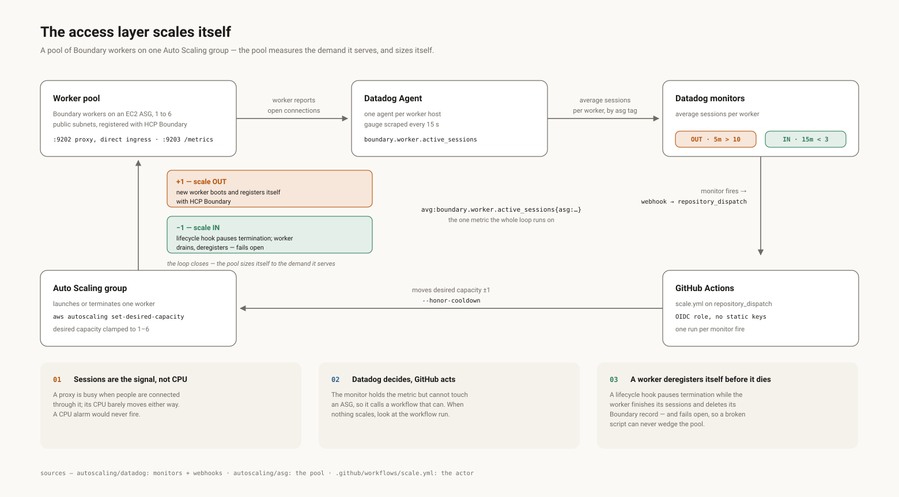

  

<h1 align="center">Zero-Trust Kubernetes Access</h1>

  Identity-driven, short-lived, RBAC-scoped access to a <b>private</b> Kubernetes API — 
  no kubeconfig distributed, no long-lived credential anywhere, no inbound network path from the internet.

  
  
  
  
  
  
  
  
  

  
  
  
  

  
  

---

Okta group in → 15-minute Kubernetes token out → proxied through a worker pool
that scales itself on live traffic. No VPN, no bastion, no standing permission.

**Built by hand first** — every layer in the console until I could draw it from
memory, then automated. The [20 documented failures](notes/Issues.md) are real,
measured on the live build.

## The numbers

| | |
|---|---|
| **Zero standing credentials** | no kubeconfig on any laptop; every session mints a 15-minute token bound to the caller's RBAC tier |
| **Private stays private** | the EKS API is never exposed — a Boundary worker inside the VPC is the only path in |
| **The access layer scales itself** | worker pool grows **1 → 6** on live session count, zero human steps |

## How a session works

1. **Okta** authenticates the human; the ID token's `groups` claim drives every
   decision downstream.
2. **Boundary** maps group → role → target and authorizes the session.
3. **Vault** (Kubernetes secrets engine) mints a 15-minute ServiceAccount token
   for the caller's tier — the user never touches Vault.
4. A **Boundary worker inside the VPC** proxies the session to the private EKS
   API; Kubernetes RBAC bounds what that token can do once it is there.

Every hop is a separate trust relationship, each labelled with the exact call
that carries it — `vault login -method=aws`, `sts:AssumeRoleWithWebIdentity`,
the TokenRequest API: [integration map](docs/integration-map.svg) ·
[port-by-port traffic flow](docs/traffic-flow.svg) ·
[Integrations](03-Integrations.md).

**The two tokens** most people conflate:

| | Okta ID token | Kubernetes SA token |
|---|---|---|
| Proves identity to | **Boundary** | **Kubernetes** |
| `sub` | your Okta user id | `system:serviceaccount:demo-app:vault-viewer` |
| Lifetime | Okta session | 15 minutes |

Boundary decides *whether you reach the API*; RBAC decides *what you can do
there*. They are independent — a Boundary admin holding a viewer token still
cannot write to the cluster.

## The access layer scales itself

One worker is a bottleneck and a single point of failure, so the last layer
replaces it with a pool that sizes itself to demand:

| Decision | Why |
|---|---|
| **Sessions are the signal, not CPU** | a proxy is busy when people are connected through it; its CPU barely moves either way |
| **Datadog decides, GitHub acts** | the monitor holds the metric but cannot touch an ASG, so it calls a workflow that can — one place to look when nothing scales |
| **A worker deregisters itself before it dies** | a lifecycle hook pauses termination until sessions drain — and fails open, so a broken script can never wedge the pool |
| **Workers accept direct connections, deliberately** | Boundary only instruments sessions that reach a worker *directly*; over the reverse path the counter reads zero forever, so there is nothing to scale on. Port 9202, a short IP allowlist, and nothing else in front of it — [reasoning](autoscaling/README.md) |

## Built by hand first

The six drawings below are my heart work — sketched by hand while each layer
went up, not generated and not copied. Each one is the map I used to force the
details into my head, and it shows more of how I learn than any bullet list
could:

1. [VPC & subnets](https://app.excalidraw.com/s/9hD7S5FgGWN/73UzMQca6Am) —
   one VPC, 3 AZs, public + private subnets, NAT, the subnet tags EKS and the
   NLB discover
2. [EKS](https://app.excalidraw.com/s/9hD7S5FgGWN/2XoNL6sXrLz) — private
   endpoint, access-entries auth, node group, the RBAC tiers
3. [Boundary ↔ Okta identity](https://app.excalidraw.com/s/9hD7S5FgGWN/7rGrKHxR5PL) —
   Okta groups claim → OIDC auth method → managed groups → roles → grants
4. [Boundary → Vault → EKS RBAC](https://app.excalidraw.com/s/9hD7S5FgGWN/2didKmVk95t) —
   the whole runtime path: worker in the VPC, credential brokering, one target
   per tier
5. [Issues — what broke and why](https://app.excalidraw.com/s/9hD7S5FgGWN/9x6Q0ZNzt0P) —
   the failures from the real build, each with *seen / cause / fix*
6. [Autoscaling](https://app.excalidraw.com/s/9hD7S5FgGWN/1Vd6jSI6hbf) — the
   worker pool: session metric, monitors, the scale-out and scale-in paths

Scene rule: do the layer by hand once, watch it work, then apply the
automation and confirm it produces the same objects. If the two differ, the
drawing is the truth and the code has drifted.

What broke along the way — the written log
[notes/Issues.md](notes/Issues.md): the 24-hour token cap on EKS, a
privilege-escalation path in an unscoped TokenRequest grant, six attempts at
one Okta claim, a session counter stuck at zero through 1,815 live proxy
events — each with cause, fix, and the design decision it forced.

## Documentation

| | |
|---|---|
| [01-Build-By-Hand.md](01-Build-By-Hand.md) | the platform, console by console — do this first |
| [02-Build-With-Terraform.md](02-Build-With-Terraform.md) | the same thing in Terraform |
| [03-Integrations.md](03-Integrations.md) | every trust relationship, and how each one fails |
| [autoscaling/](autoscaling/README.md) | the self-scaling worker pool, built on top of all of it |
| [notes/Issues.md](notes/Issues.md) | the full failure log, indexed by component |

This page is the architecture; the docs above are the builds. Build order
matters: **EKS → Kubernetes RBAC → Vault → worker → Okta → Boundary** — each
layer references names created by the one before it.

## Known limitations

- **Vault runs in dev mode** — in-memory, auto-unsealed, plaintext HTTP over
  the internal NLB. First production task: HCP Vault Dedicated or in-cluster Raft.
- **Port 9202 depends on an IP allowlist** — deliberate, but if your address
  rotates, sessions silently fall back to the uninstrumented path and the
  metric reads zero. It looks like a regression; it is a network change.

## Roadmap

- **Session recording (BSR)** — full keystroke audit; usually what completes a
  PAM story for auditors.
- **Spot instances for the pool** — the lifecycle hook and self-registration
  already handle abrupt termination, so most of the work is done.
- **Drop `secrets` from the viewer Role** — the most restricted tier can
  currently read every Secret in `demo-app`.
- **A self-hosted runner in the VPC** — unblocks the rotation and infra
  workflows without exposing Vault publicly.
- **AMI hygiene** — deregister superseded images, delete their snapshots.
- **Terraform-manage the lifecycle hook** — `initial_lifecycle_hook` is honoured
  only at ASG creation; `aws_autoscaling_lifecycle_hook` manages updates.

---

  Designed, built by hand, drawn, then automated by <b>Kyaw Sithu</b> ·
  <a href="https://kst-devops.com">kst-devops.com</a> ·
  <a href="https://github.com/rosaliei">@rosaliei</a>

