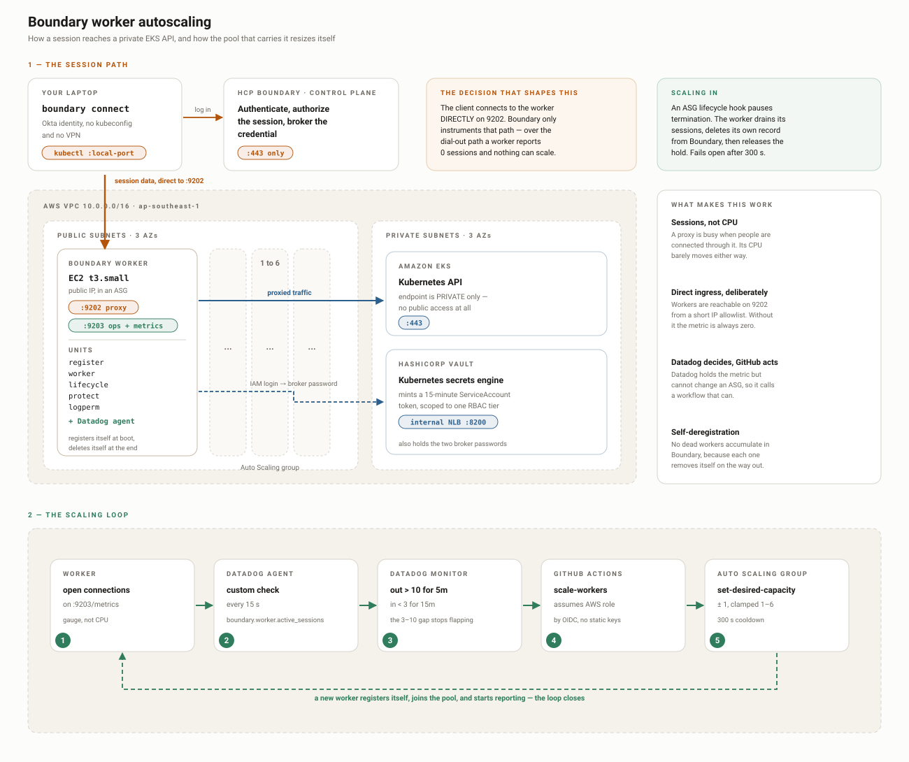

# Boundary worker autoscaling — architecture

A pool of Boundary workers that grows when people are using it and shrinks when
they are not, with no human in the loop.

- **[Build by hand](01-Build-By-Hand.md)** — build it by hand, once, so you have touched every part
- **[Build with Terraform](02-Build-With-Terraform.md)** — the Terraform + GitHub Actions version
- **[notes/Issues.md](../notes/Issues.md)** — everything that broke while building it, and why

> **This layer sits on top of the base platform — build that first.**
> It reuses the VPC and subnets, the private EKS cluster, the Vault Kubernetes
> secrets engine, and the Boundary targets and credential stores created by
> [Build by hand](../01-Build-By-Hand.md) (or
> [Build with Terraform](../02-Build-With-Terraform.md)). Nothing here
> creates them, and every step assumes one worker is already registered and
> working.

---

## The shape of it



Two halves, and they meet at the worker.

**The session path** (orange) — you authenticate to HCP Boundary on 443, then
your client connects **straight to a worker's public IP on 9202**. The worker
proxies that to the private EKS API and fetches a 15-minute credential from
Vault on the way.

**The scaling loop** (green) — the worker reports how many connections it is
carrying, Datadog decides, GitHub Actions acts, the ASG resizes, and a new
worker registers itself and starts reporting. The loop closes.

In one line: **sessions → metric → monitor → workflow → pool size**.

---

## Decisions, and why

### Scale on sessions, not CPU

A Boundary worker is a TCP proxy. It is busy when people are connected through
it, and its CPU barely moves either way. CPU would tell you nothing.

The metric is **open proxy connections per worker**, averaged across the pool.

### Workers are publicly reachable — deliberately

This is the decision that surprises people, and it is not for convenience.

Boundary can route a session two ways. If the worker only dials **out**, the
client meets it over a reverse connection inside HCP. That works fine — but
Boundary does not instrument that path, so the worker reports **zero sessions
forever** and nothing can scale.

Making the worker directly reachable puts the session on the instrumented path,
where the counters are real. Four things have to line up:

| | |
|---|---|
| Public subnet | with a public IP forced in the launch template |
| `public_addr` | read from instance metadata at boot — it differs per instance |
| Security group | 9202 open to the client's IP, not just the VPC |
| Target | **both** an ingress and an egress worker filter, on every target |

**The rule this creates: a worker may carry the `eks` tag only if it is directly
reachable.** Before ingress filtering an unreachable worker was merely unused;
after it, the filter selects that worker and the client cannot connect. The
single hand-built worker from the base build advertises `0.0.0.0:9202` from a
private subnet, so it must be removed from the registry once the pool exists —
stopping its instance is not enough, the worker record outlives it.

The trade: the workers are on the internet on port 9202, and the security group
is the only thing in front of them. Everything else about the design — private
EKS endpoint, brokered credentials, no long-lived secrets — is unchanged.

### The metric comes from `/metrics`, not `/health`

The obvious source, `/health?worker_info=1` → `active_session_count`, is
**always 0** on Boundary v1.0.1+ent. Not a lag — a live tunnel with a thousand
proxy events and the field still reads zero.

The Prometheus endpoint on the same port does work. The check reads
`boundary_worker_proxy_websocket_active_connections` from there instead. No
Prometheus server is involved; it is a URL that returns lines of text.

### Scale out fast, scale in slow

| | Out | In |
|---|---|---|
| Threshold | more than **10** sessions/worker | fewer than **3** |
| Window | 5 minutes | 15 minutes |
| Re-fire | every 10 min | every 20 min |

The gap between 3 and 10 is what stops it oscillating: adding a worker halves
the average immediately, and a scale-in threshold near 10 would fire straight
back.

### Datadog decides, GitHub acts

Datadog owns the decision because it already holds the metric. It cannot change
an ASG, so it calls a GitHub workflow, which assumes an AWS role by OIDC and
moves desired capacity by one.

No CloudWatch alarms, no scaling policies on the ASG. One place to look when
something does not scale: the workflow run.

### A worker deregisters itself before it dies

An ASG lifecycle hook holds a terminating instance in `Terminating:Wait`. The
worker uses that pause to finish its sessions and delete its own record from
Boundary, then releases the hold. Without it you accumulate dead workers in the
Boundary UI.

The hook fails **open** — if the script breaks, the instance still terminates
after 300 seconds. A broken cleanup script can never wedge the pool.

### Two brokers, one verb each

Registration and deregistration use different Boundary accounts. One may only
`create` workers, the other may only `delete` them. Both passwords live in
Vault and are fetched at boot using the instance's own IAM identity — nothing
is baked into the image and no password is on disk.

---

## What runs on a worker

Five units, all installed by Ansible into the AMI.

| Unit | When | Does |
|---|---|---|
| `boundary-register` | once at first boot | Vault login → get registrar password → create the worker in Boundary → write `worker.hcl` |
| `boundary-worker` | always | the proxy itself, ports 9202 (proxy) and 9203 (ops) |
| `boundary-lifecycle` | always | watches for termination → drains → deletes the worker → releases the hook |
| `boundary-protect` | every minute | turns on scale-in protection while the worker has sessions |
| `boundary-logperm` | when the log appears | makes the event log readable by the Datadog agent |

Plus the Datadog agent, which runs the custom check every 15 seconds.

`/etc/boundary/env` is written by user-data at boot and holds the addresses and
names every script reads. It is the one file to look at first when a worker
misbehaves.

---

## Sizing and cost

`t3.small`, not `t3.micro`. The worker itself is small, but it shares the box
with the Datadog agent, and 1 GiB is not enough for both — the kernel kills
Boundary, systemd restarts it every five seconds, and the burst credits run out.

At roughly $0.03/hour per worker, a pool of six costs about $0.18/hour. The NAT
gateway and the EKS control plane cost more than the workers do.

---

## Where things live

```
autoscaling/
├── README.md                   this file
├── 01-Build-By-Hand.md         build it by hand
├── 02-Build-With-Terraform.md  build it with Terraform + Actions
├── packer/                     bakes the worker AMI
├── ansible/                    what goes into the AMI
├── asg/                        launch template, ASG, IAM, security group
├── brokers/                    the two Boundary accounts + Vault roles
├── datadog/                    monitors, webhooks, dashboard
└── scripts/                    scale-to-workers.sh, the load generator
```
